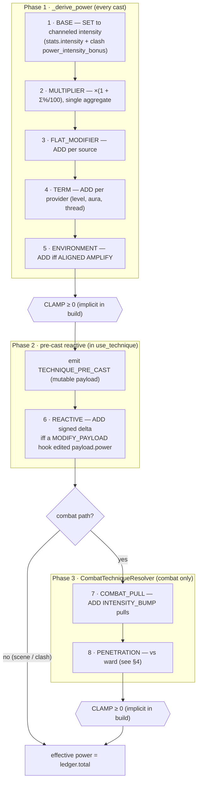
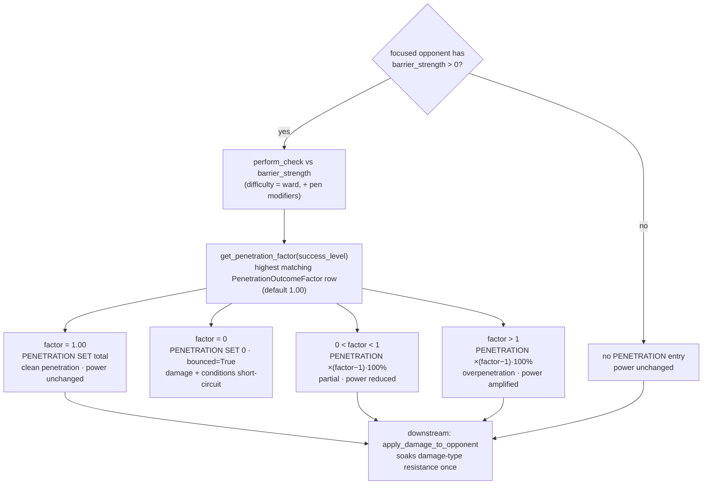

# Power Derivation Pipeline (#524 → #639 / Direction B)

**Status:** fully built and wired (Issues #524–#639).
**Companion docs:** `docs/architecture/technique-use-pipeline.md` (How Magic Works — the
end-to-end cast lifecycle this pipeline sits inside), `docs/architecture/power-intensity-research.md`
(landscape + candidate directions), `docs/architecture/power-intensity-research-critique.md`.

This doc is the **authoritative reference for power derivation**: the stages, the
penetration contest, and how the ledger is surfaced. For the wider cast lifecycle
(entry paths, intensity-vs-power costs/risks, narration) read the companion above.

---

## 1. Problem and invariant

`use_technique` emits `TECHNIQUE_PRE_CAST` with a mutable payload. Before #524 a
`MODIFY_PAYLOAD` trigger's edit to `power` had no effect because the code kept using
`stats.intensity` downstream — the modify path was a no-op. #524 closed that gap.

**Load-bearing invariant (never relaxed):** *Power is always a **derived** value, never
stored.* It is recomputed each cast. No persisted `power` column exists; none will be
added. Modifiers *contribute to* power; they are never *stored as* power.

---

## 2. Intensity vs power

- **Intensity** — what the caster *channels*. Drives anima cost, mishap (`control_deficit`),
  resonance attribution, and Soulfray. A ward must never reduce this.
- **Power** — the *effective magnitude the working carries into the world*. Drives damage
  budgets, condition severity/duration, capability grants, and per-round clash progress
  magnitude. This is the modifiable lever.

The two values are separately carried on `TechniquePreCastPayload` (`intensity`, `power`).
Caster-side calculations always read `stats.intensity`; world-side calculations read `power`
(post-hook, from the resolved ledger).

---

## 3. `_derive_power` — the ledger pipeline

`_derive_power` (`world/magic/services/techniques.py`) returns a transient
**`PowerLedger`** (`world/magic/types/power_ledger.py`). The ledger is an ordered tuple of
**`PowerLedgerEntry`** records, each tagged with a `PowerStage` constant, an `op`
(`LedgerOp`: `ADD / MULTIPLY / SET`), an `amount`, and a running total. `ledger.total`
is the effective power (floored at 0).

### 3.1 Stage ordering — the three assembly phases

Power is assembled in **three phases**, in this exact execution order. Phases 1
and 2 run on every cast; phase 3 runs only on the combat path. The `CLAMP` floor
(≥ 0) is appended *implicitly* by every `PowerLedgerBuilder.build()` whenever the
running total has gone negative — it is never invoked as a separate step.

**Phase 1 — `_derive_power` (every cast), build order:**

| # | Stage | Source | How applied |
|---|-------|--------|-------------|
| 1 | **BASE** | The channeled intensity passed in: `stats.intensity` from `get_runtime_technique_stats` (identity + process modifiers, Audere intensity, tier penalty, social safety) plus the clash `power_intensity_bonus` (`strain_to_intensity` — power-only, never anima) | `SET` to channeled intensity |
| 2 | **MULTIPLIER** | `power_multiplier` `ModifierTarget` via `get_modifier_breakdown` + `get_condition_modifier_breakdown`. Immunity-blocked sources excluded. | Single aggregate `×(1 + Σ%/100)` applied to BASE only — one `multiply` call, never per-source, to avoid repeated rounding drift |
| 3 | **FLAT_MODIFIER** | Per-source additive power modifiers via `get_modifier_breakdown` (immunity-blocked excluded) + per-condition rows via `get_condition_modifier_breakdown` | `ADD` per non-zero source |
| 4 | **TERM** | `get_power_term_providers()` — `level`, `aura`, and `thread` all live (#768), applied in registry order | `ADD` per provider |
| 5 | **ENVIRONMENT** | Cast-time `evaluate_resonance_environment` AMPLIFY magnitude only | `ADD` if `kind == AMPLIFY and magnitude > 0` |

`_derive_power` returns `builder.clamp_floor().build()`, so a `CLAMP` entry is
appended at the end of phase 1 if the running total is already negative.

**Phase 2 — pre-cast reactive (in `use_technique`, after the `TECHNIQUE_PRE_CAST` emit):**

| # | Stage | Source | How applied |
|---|-------|--------|-------------|
| 6 | **REACTIVE** | A pre-cast `MODIFY_PAYLOAD` trigger edit to `payload.power`, reconciled by `_reconcile_precast_ledger` after the event is emitted and **before** the resolver runs | `ADD` signed delta between the hook-edited `payload.power` and the seed ledger total (only when a hook changed it) |

On the non-combat (scene) and clash paths, `ledger.total` after phase 2 *is* the
effective power — phase 3 does not run.

**Phase 3 — combat resolver (`CombatTechniqueResolver.__call__`, combat path only):**

| # | Stage | Source | How applied |
|---|-------|--------|-------------|
| 7 | **COMBAT_PULL** | INTENSITY_BUMP pulls via `_sum_intensity_bump_pulls` | `ADD` |
| 8 | **PENETRATION** | `get_penetration_factor(pen_result.success_level)` from the authored `PenetrationOutcomeFactor` ladder (see §4) | `SET 0` (bounce), `SET total` (clean penetration), or `multiply` by `(factor−1)×100` pct |

The resolver's `build()` re-applies the `CLAMP` floor, so a ward or pull that
drives power negative still resolves to 0.

> **Execution order, exactly:** `BASE → MULTIPLIER → FLAT_MODIFIER → TERM →
> ENVIRONMENT → [CLAMP] → [REACTIVE] → COMBAT_PULL → PENETRATION → [CLAMP]`.
> `REACTIVE` lands *before* `COMBAT_PULL`/`PENETRATION` because it is reconciled in
> `use_technique` before the combat resolver receives the ledger.

### 3.2 Stacking model

Stacking is entirely delegated to `get_modifier_breakdown` and `get_condition_modifier_breakdown`.
`_derive_power` does not contain multiplicative-math or stacking logic of its own: the
MULTIPLIER pool is additive-% aggregated first (Σ%), then applied as a single `×(1+Σ%/100)` to
BASE. FLAT stage sources are additive. No special stacking code was added to the pipeline;
the existing modifier system's immunity handling and source attribution carry through.

### 3.3 ENVIRONMENT stage — evaluate-once, AMPLIFY only, double-count guard

`evaluate_resonance_environment` is called **once per cast**, before `_derive_power`, and the
result is passed in as the `environment` argument. This evaluate-once pattern (#639/#722
guard) prevents the primitive from running twice (once for power, once for backfire).

Only AMPLIFY (ALIGNED diagonal) adds power here. Double-count guards:

- **OPPOSED** (REJECT/REPEL/CORRUPT): no power change. The opposition penalty is already the
  Step 10 backfire (`resonance_environment_for_cast`). Subtracting power here would double-count.
- **ALIGNED persistent presence boon**: applied as a `ConditionInstance` on room entry via
  `refresh_resonance_alignment`. That condition's modifier rows already flow through the
  FLAT/condition stage above. Adding it again here would double-count.

### 3.4 REACTIVE entry

After `TECHNIQUE_PRE_CAST` is emitted, `_reconcile_precast_ledger` reads `pre_payload.power`. If a
trigger edited it via `MODIFY_PAYLOAD`, the signed delta is appended as a `REACTIVE` entry so the
ledger stays internally consistent (`ledger.total == effective_power`). This happens **before** the
combat resolver runs (phase 2, ahead of `COMBAT_PULL`/`PENETRATION`). The ledger's floor (≥0) then
becomes the canonical `effective_power`, ensuring a ward-driven 0 is honoured even if the hook
pushed power negative.

---

## 4. Penetration-vs-resistance contest

When the focused opponent has a `barrier_strength > 0` (a ward), the combat resolver runs a
**penetration check** (`perform_check` against `barrier_strength` as the difficulty) before
damage and condition resolution.

The result's `success_level` is looked up against the authored `PenetrationOutcomeFactor` ladder
via `get_penetration_factor(success_level)` (`world/conditions/services.py`). The ladder is a
queryset of `PenetrationOutcomeFactor` rows ordered by `min_success_level`; the highest
matching row's `factor` is returned (default `Decimal("1.00")` when no row matches — an
unauthored ladder must never accidentally zero out a working).

`barrier_strength` is the **ward gate** only; damage-type **resistance/soak** is a
separate, downstream step (see "No double-counting" below). The two never interact.

**Outcomes by factor value:**

| Factor | Ledger entry | Effect |
|--------|-------------|--------|
| `0` | `PENETRATION SET 0` `"ward (bounced)"` | `bounced=True` — damage/conditions short-circuited; the ledger records the bounce for narration |
| `1.00` (exactly) | `PENETRATION SET total` `"ward (penetrated)"` | `bounced=False`, power unchanged. The entry distinguishes a warded-but-cleanly-penetrated cast from an unwarded one (which records no PENETRATION entry at all). |
| `0 < factor < 1` | `PENETRATION multiply (factor−1)×100 pct` (negative) | Partial — power reduced |
| `factor > 1` | `PENETRATION multiply (factor−1)×100 pct` (positive) | Overpenetration — power amplified |

**No double-counting with resistance/soak:** `barrier_strength` is the ward gate only.
Damage-type resistance is soaked once, downstream, in `apply_damage_to_opponent`. The
penetration contest does not touch resistance; resistance does not interfere with the
penetration roll.

---

## 5. Snapshot vs recompute decision: RECOMPUTE

Power is **never stored**. Each call to `use_technique` recomputes it via `_derive_power` from
the current character state. There is no persisted `power` column anywhere. Later issues
may add more input terms to `_derive_power`; the derivation point is centralised so those
additions are one-place changes.

---

## 6. Ledger surfacing — payloads and narration

The ledger rides the event payloads throughout the pipeline:

- `TechniquePreCastPayload` — carries `intensity`, `power` (seed total), and `ledger` (seed
  ledger). Mutable; a `MODIFY_PAYLOAD` trigger may edit `power`.
- `TechniqueCastPayload` — frozen; carries `power` (effective) and `ledger` (effective, with
  REACTIVE entry appended if any hook edited it).
- `TechniqueAffectedPayload` — frozen; carries `power` (effective) and `ledger` (effective).

**Clash contributions** also persist the ledger via `persist_power_ledger` on
`ClashContribution`, recording the full strain→intensity→power→delta story per round.
This is caster- and staff-gated on the action-outcome panel — the same ledger data,
surfaced through the clash contribution's interaction record.

Narration reads the ledger via `power_outcome_clause(power_ledger)` in
`world/magic/narration.py` (composed from the `_penetration_clause` and
`_environment_clause` helpers there). `render_action_outcome_narration`
(`world/combat/interaction_services.py`) calls it to fold a concise ward/environment
outcome clause into the combat outcome line; `render_cast_outcome_narration`
(`world/magic/narration.py`) does the same for non-combat scene casts:

- Full bounce → `"— the ward turns it aside"`
- Partial penetration → `"— the ward bleeds off much of its force"`
- Clean/over-penetration → `"— it tears through the ward"`
- Environment amplification (no PENETRATION entry, positive ENVIRONMENT ADD) →
  `"— the place's resonance swells the working"`
- Plain unwarded, non-magic, or combo path → no clause (backward compatible)

---

## 7. Key symbols (where to find the code)

| Symbol | Module |
|--------|--------|
| `PowerLedger`, `PowerLedgerEntry`, `PowerLedgerBuilder` | `world/magic/types/power_ledger.py` |
| `PowerStage`, `LedgerOp` | `world/magic/constants.py` |
| `_derive_power`, `_reconcile_precast_ledger`, `use_technique` | `world/magic/services/techniques.py` |
| `get_modifier_breakdown` | `world/mechanics/services.py` |
| `get_condition_modifier_breakdown` | `world/conditions/services.py` |
| `get_penetration_factor`, `PenetrationOutcomeFactor` | `world/conditions/services.py`, `world/conditions/models.py` |
| `CombatTechniqueResolver` (`__call__`, `_apply_penetration`) | `world/combat/services.py` |
| `power_outcome_clause`, `_penetration_clause`, `_environment_clause`, `render_cast_outcome_narration` | `world/magic/narration.py` |
| `render_action_outcome_narration` | `world/combat/interaction_services.py` |
| `evaluate_resonance_environment` | `world/magic/services/resonance_environment.py` |
| `strain_to_intensity`, `outcome_to_delta` | `world/combat/clash.py` |
| `ClashConfig` (power-formula knobs: `power_scale`, `botch_backfire_fraction`) | `world/combat/models.py` |

---

## 8. History

- **#524** — introduced `power` as a derived, never-stored value seeded from `stats.intensity`;
  wired the pre-cast `MODIFY_PAYLOAD` path so trigger edits to `power` reach resolution; closed
  the discard-on-emit gap; split caster-side from world-side effects. `_derive_power` returned
  a scalar at this stage.
- **#634–#638** — added modifier/level/thread/aura/Audere terms to the derivation.
- **#639 (Direction B)** — rewrote `_derive_power` to return a `PowerLedger`; added the
  MULTIPLIER/FLAT/TERM/ENVIRONMENT/REACTIVE stages; introduced the penetration-vs-resistance
  contest and the `PenetrationOutcomeFactor` ladder; wired the ledger through combat resolution
  and narration; evaluate-once environment guard.
- **#769** — added the mermaid diagrams (assembly phases + penetration contest); corrected the
  §3.1 stage table to the as-built execution order (`REACTIVE` lands before `COMBAT_PULL`, not
  after `PENETRATION`); fixed the narration symbol references (`power_outcome_clause` lives in
  `world/magic/narration.py`, not `interaction_services.py`).
