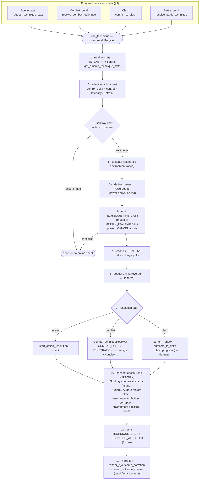

# How Magic Works — The Technique Cast Lifecycle

**Status:** as-built. This documents the live `use_technique` pipeline end to end.
**Companion docs:** `docs/architecture/power-derivation.md` (the authoritative
reference for the power ledger and the penetration-vs-resistance contest — read it
for the internals of step 5/“resolve” below), `docs/systems/magic.md` (model/API
catalog), `docs/architecture/combat-magic-integration.md`,
`docs/architecture/non-clash-casting.md`, `docs/architecture/soulfray-progression-design.md`,
`docs/architecture/runtime-modifiers-audere.md`.

This is the "I use Flame Lance" pipeline: from choosing to cast through cost,
resolution, consequences, and narration. It is the spine that connects the magic
system to combat, scenes, and the reactive (flows) layer. `use_technique`
(`world/magic/services/techniques.py`) is the single canonical entry that every
cast funnels through, no matter how it started.

---

## 1. Design principles (load-bearing)

These shaped the system and still hold:

- **Anima is not a gate.** A character can always attempt magic. Anima determines
  *safety*, not access. When anima runs out, the deficit is drawn from the caster's
  life force (overburn).
- **Risk is always explicit.** Any outcome that could harm the character requires an
  opt-in checkpoint — the player sees the cost and the danger and deliberately
  confirms (the Soulfray-risk confirmation, step 3).
- **The technique always works.** The intended effect resolves through the normal
  check/consequence pipeline. Mishaps from loss of control are *additional*
  consequences, never replacements for the intended effect.
- **Intensity is genuinely better — and genuinely costlier.** Pushing intensity
  raises the *landed effect* (it is the base of power). The trade-off is higher anima
  cost and mishap/Soulfray risk, not a penalty on effectiveness.
- **Control is efficiency.** High control reduces anima cost and eliminates mishap
  risk. Mastery means casting cheaply with no side effects.

---

## 2. The two magnitudes: intensity vs power

A cast carries **two** separate magnitudes. Keeping them apart is the central
invariant of the whole system (full detail in `power-derivation.md` §2):

- **Intensity** — what the caster *channels*. It governs **cost and risk**: anima
  cost, control mishap (`control_deficit`), Soulfray accumulation, Audere gating,
  and resonance attribution. A ward must never reduce intensity.
- **Power** — the *effective magnitude the working carries into the world*. It
  governs **landed effect**: damage budgets, condition severity/duration, capability
  grants, and per-round clash progress. Power is the modifiable lever; it is always
  **derived, never stored**, recomputed every cast.

They start from the same base (intensity seeds power) and then diverge — power picks
up multipliers, flat bonuses, environment amplification, combat pulls, and pre-cast
reactive edits, while the cost/risk side keeps reading raw intensity. See the
intensity-vs-power table in §6.

---

## 3. Entry points — four ways a cast starts

Every path converges on `use_technique`. Prerequisites (the caster knows the
technique; the technique has a castable `action_template`; hostility/consent rules)
are enforced at the entry layer, before `use_technique` runs.

| Path | Entry | Notes |
|------|-------|-------|
| **Scene cast (non-combat)** | `request_technique_cast` → `_resolve_cast` (`world/scenes/cast_services.py`) | Routes to immediate (self/room/no-target), benign (PENDING consent), or hostile (seeds/feeds a combat encounter). |
| **Combat round** | `_resolve_pc_action` → `resolve_combat_technique` (`world/combat/services.py`) | Builds a `CombatTechniqueResolver` and passes it as the resolve function. |
| **Clash contribution** | `commit_to_clash` (`world/combat/clash.py`) | Check-only resolve function — no damage; power drives `outcome_to_delta` → clash progress. |
| **Battle technique resolution** | `resolve_battle_technique` (`world/battles/resolution.py`) | Casts a `BattleActionDeclaration`'s technique through the real magic envelope — converges on `use_technique` like the others, so anima/Soulfray/mishap and Audere escalation apply normally; the result routes to unit attrition / VP. |

Hostile scene casts against another PC may park as a PENDING `SceneActionRequest`
until the target consents; on accept the request re-routes through the same lifecycle.

---

## 4. The lifecycle at a glance

---

## 5. The lifecycle, step by step

All symbols below live in `world/magic/services/techniques.py` unless noted.
Steps marked **[INTENSITY]** read the channeled intensity (cost/risk side); steps
marked **[POWER]** read the derived power (landed-effect side).

1. **Runtime stats** — `get_runtime_technique_stats` computes the cast's
   **intensity** and **control** from the technique's authored base plus the
   identity stream (`CharacterModifier` rows: traits, equipment, conditions), the
   process stream (`CharacterEngagement.intensity_modifier` / `.control_modifier`,
   where Audere's bonus lands), a social-safety control bonus when un-engaged, and
   the `IntensityTier` control penalty. **[INTENSITY]**
2. **Effective anima cost** — `calculate_effective_anima_cost`:
   `effective_cost = max(base_cost − (control − intensity), 0) + max(strain_commitment, 0)`.
   High control lowers cost; high intensity raises it. **[INTENSITY]**
3. **Soulfray safety checkpoint** — if an active Soulfray stage warns of risk and the
   caster has not confirmed, the cast **aborts with no anima spent**, returning an
   unconfirmed result for the UI to confirm.
4. **Evaluate resonance environment (once)** — `evaluate_resonance_environment` runs
   a single time; the result feeds both power derivation (step 5) and the
   environment reaction (step 10). Evaluating once is a deliberate double-count guard.
5. **Derive power** — `_derive_power` builds the `PowerLedger` from the channeled
   intensity (BASE) through MULTIPLIER, FLAT_MODIFIER, TERM, and ENVIRONMENT stages.
   **[POWER]** — see `power-derivation.md` §3 for the stage internals.
6. **`TECHNIQUE_PRE_CAST` (mutable)** — `emit_event` fires the event with a mutable
   `TechniquePreCastPayload` carrying `intensity`, `power`, and the seed `ledger`. The
   reactive (flows) layer runs matching triggers: `MODIFY_PAYLOAD` steps edit
   `payload.power` in place (this is how reactive conditions/room properties bend a
   cast); a `CANCEL` step aborts the cast before any anima is spent.
7. **Reconcile reactive + charge pulls** — `_reconcile_precast_ledger` compares the
   hook-edited `payload.power` to the seed total and appends a `REACTIVE` ledger entry
   for any delta (so `ledger.total` stays canonical). Declared resonance pulls are
   charged here (`spend_resonance_for_pull`), after the cancel gate, before anima. **[POWER]**
8. **Deduct anima** — `deduct_anima` spends `effective_cost` under `SELECT FOR UPDATE`;
   any shortfall is the **overburn deficit**, drawn from life force. **[INTENSITY]**
9. **Resolve the intended effect** — the resolve function runs for the active path:
   - **Scene:** `start_action_resolution` performs the action check with the enhanced
     capability values.
   - **Combat:** `CombatTechniqueResolver.__call__` receives the effective power,
     adds the `COMBAT_PULL` stage, runs the **penetration** contest against the
     target's ward, then computes the damage budget and condition scaling from the
     resulting power and calls `apply_damage_to_opponent` (which soaks resistance). **[POWER]**
   - **Clash:** a check-only resolve function; power is captured for `outcome_to_delta`
     → `ClashRound` progress (no damage applied here). **[POWER]**
10. **Consequences** — fired after the effect resolves, all reading **intensity**:
    Soulfray accumulation (`calculate_soulfray_severity`, scales with anima ratio and
    deficit), the control mishap rider when `control_deficit = intensity − control > 0`
    (`select_mishap_pool` → consequence-pool roll), technique fatigue, Audere /
    Audere Majora offer gating (`maybe_create_audere_offer`), resonance attribution
    (intensity split across the gift's resonances), per-cast corruption accrual, and the
    resonance-environment reaction (OPPOSED-cast backfire / place defilement). **[INTENSITY]**
11. **`TECHNIQUE_CAST` + `TECHNIQUE_AFFECTED` (frozen)** — `_emit_cast_events` emits the
    frozen `TechniqueCastPayload` (caster's room) and a `TechniqueAffectedPayload` per
    target. These are immutable by design: a `MODIFY_PAYLOAD` attempt raises.
12. **Narration** — a deterministic one-line outcome pose. Non-combat uses
    `render_cast_outcome_narration`; combat uses `render_action_outcome_narration` then
    broadcasts live. Both fold in `power_outcome_clause` for the ward/environment tag
    (e.g. "the ward turns it aside", "it tears through the ward",
    "the place's resonance swells the working").

---

## 6. Intensity vs power, by step

| Step | Reads | Why |
|------|-------|-----|
| 1 runtime stats | **INTENSITY** (computes it) | base + identity + process + social safety − tier penalty |
| 2 anima cost | **INTENSITY** | `control − intensity` sets cost |
| 5 derive power | **INTENSITY → POWER** | intensity seeds the power BASE |
| 6–7 pre-cast reactive | **POWER** | hooks edit `payload.power` only |
| 8 deduct anima | **INTENSITY** | overburn deficit from intensity-driven cost |
| 9 resolve (combat/clash) | **POWER** | damage budget, condition scaling, clash delta |
| 10 Soulfray / mishap / Audere / attribution | **INTENSITY** | cost & risk, never power |

**Invariant:** intensity governs *cost and risk*; power governs *landed effect*.
The anima / Soulfray / mishap / Audere paths are insulated from power-side modifiers
by construction — a ward or a buff that changes power never changes what the cast
costs the caster.

---

## 7. Branch points

- **Combat vs non-combat vs clash** — chosen at the entry layer (§3). Only the combat
  path runs `CombatTechniqueResolver` (pull + penetration + damage); the scene path
  runs an action check; the clash path is check-only and feeds clash progress.
- **Hostile vs benign target (scene)** — a hostile cast seeds/feeds a combat encounter
  instead of resolving inline; a benign cast on another PC parks for consent, then
  resumes the lifecycle on accept.
- **Overburn vs safe** — when `effective_cost > current anima`, step 8 draws the
  deficit from life force and step 10's Soulfray accumulation escalates accordingly.
  Non-lethal encounters clamp cost to available anima (no overburn).
- **Warded vs unwarded target** — only a target with `barrier_strength > 0` triggers
  the penetration contest (`power-derivation.md` §4); unwarded casts record no
  `PENETRATION` ledger entry.

---

## 8. Where to find the code

| Concern | Symbol(s) | Module |
|---------|-----------|--------|
| Canonical lifecycle | `use_technique`, `get_runtime_technique_stats`, `calculate_effective_anima_cost`, `_derive_power`, `_reconcile_precast_ledger`, `_emit_cast_events` | `world/magic/services/techniques.py` |
| Scene entry | `request_technique_cast`, `_resolve_cast`, `render_cast_outcome_narration` | `world/scenes/cast_services.py`, `world/magic/narration.py` |
| Combat entry & resolver | `_resolve_pc_action`, `resolve_combat_technique`, `CombatTechniqueResolver`, `apply_damage_to_opponent` | `world/combat/services.py` |
| Clash | `commit_to_clash`, `strain_to_intensity`, `outcome_to_delta` | `world/combat/clash.py` |
| Anima | `deduct_anima` | `world/magic/services/anima.py` |
| Soulfray / mishap | `calculate_soulfray_severity`, `select_mishap_pool` | `world/magic/services/soulfray.py` |
| Audere gating | `maybe_create_audere_offer`, `maybe_create_audere_majora_offer` | `world/magic/audere.py` |
| Event payloads | `TechniquePreCastPayload`, `TechniqueCastPayload`, `TechniqueAffectedPayload` | `flows/events/payloads.py` |
| Reactive dispatch | `emit_event`, `MODIFY_PAYLOAD` / `CANCEL` flow actions | `flows/emit.py`, `flows/models/flows.py` |
| Power internals | see the full symbol table | `docs/architecture/power-derivation.md` §7 |

---

## 9. History

- Original design (pre-implementation) defined the MVP flow (runtime stats → anima
  cost → safety checkpoint → deduct → resolve → overburn → mishap) and the
  forward-looking design notes on Soulfray progression, Audere, and non-lethal vs
  lethal mishap pools.
- **#524–#639** built the derived-power pipeline, the `PowerLedger`, the
  penetration-vs-resistance contest, the resonance-environment integration, and the
  reactive `MODIFY_PAYLOAD` path (see `power-derivation.md` §8).
- **#769** rewrote this document to the as-built end-to-end lifecycle and added the
  overview mermaid diagram (the "How Magic Works" pass).
