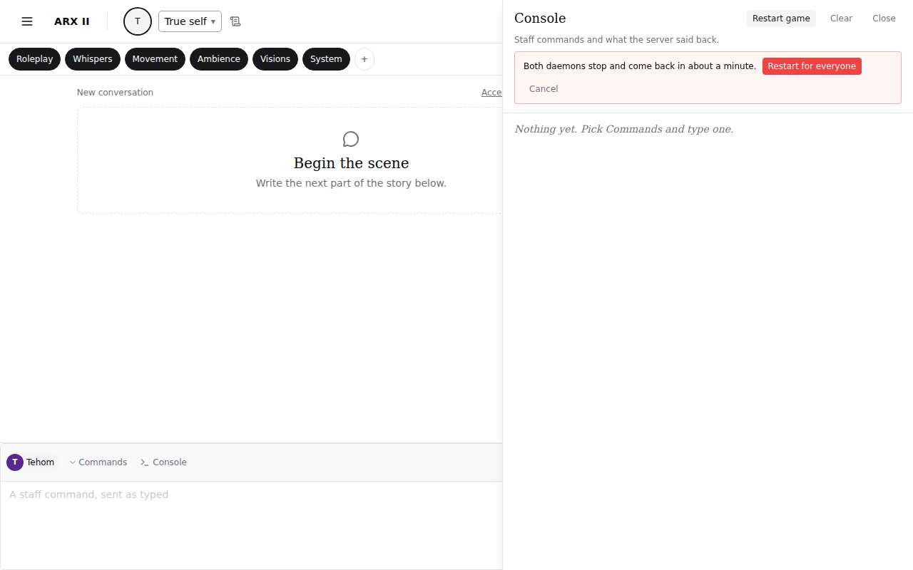
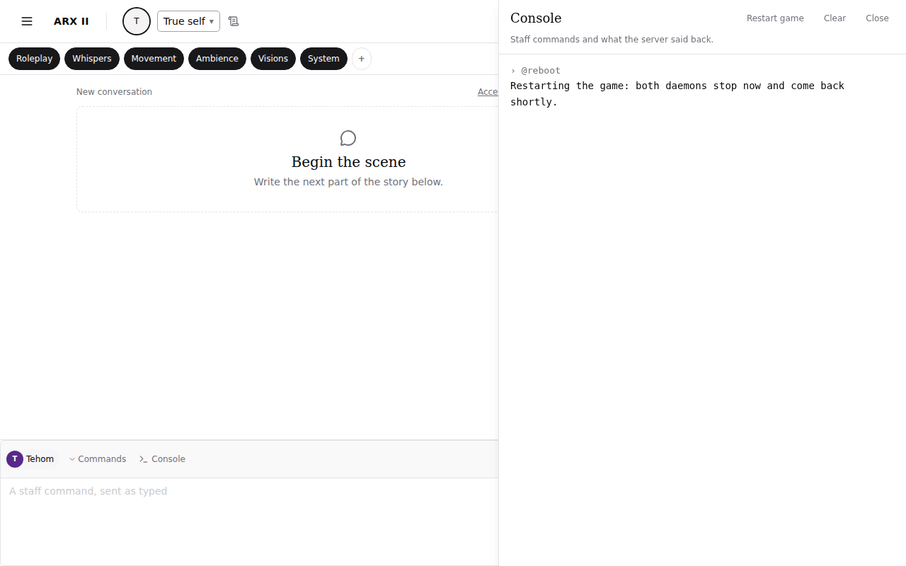
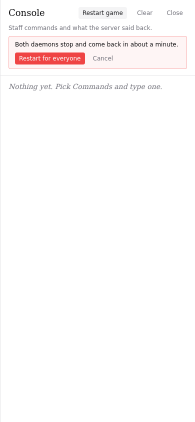

# Review evidence

- Reviewed revision: `e10b124a640dfcd45273cf11e7834ef3a9dcc070`
- Reviewer: `mock-fidelity-reviewer` (dispatched), `unarmed-safeguard-reviewer` and `implementation-quality-reviewer` (operability lens) run as general agents carrying their definitions, plus the authoring agent for the visual comparison against the #4001 spec text
- Reviewer verdict: PASS
- Application/build identity: production bundle (`pnpm build`, Vite 6) served by `vite preview` on port 4173 through Playwright 1.58.2, branch `feature-4001-re-arm-the-tick-level-db-heal-at-boot-an`
- Environment: Linux devcontainer, headless Chromium 1208 (Playwright), REST and websocket answered by the shared e2e harness fixtures (`frontend/e2e/support/gameHarness.ts`); backend Python tests on the SQLite fast tier; infra checks via `infra/scripts/acceptance.sh`
- Viewports/themes: 1280x800 light, 390x844 light
- Approved design: https://github.com/Arx-Game/arxii/issues/4001 (spec text; the issue carries no demo page, so the reference is the spec's description of the control, the inline confirm step and the sent line)
- Visual review: Completed
- Visual verdict: PASS
- Screenshots:    
- Comparison notes: the spec asks for a "Restart game" control in the console sheet header with an inline confirm step (a second press on "Restart for everyone" sends, "Cancel" dismisses) that sends `@reboot` through the existing console path so the echo and the answer land in the console. All four are present in the captures. The control sits in the sheet header beside Clear and Close; the confirm row carries the one-sentence explanation, a destructive-styled "Restart for everyone" and a muted "Cancel"; after confirming, the console shows the echoed `› @reboot` above the server's answer. At 390px the row wraps to two lines and stays inside the sheet. No discrepancies.
- Tested interactions: staff pick Commands, open Console, press Restart game (nothing sent), Cancel (nothing sent, row gone), Restart game again, Restart for everyone (one `['@reboot', {console: true}]` text frame on the socket, echoed in the console), a console-tagged server answer lands in the sheet; no page errors. Backend: `@reboot` writes the request file before the Portal shutdown, announces naming the requester, refuses to shut down when the file cannot be written; the command is Developer-locked, in the account cmdset beside `@shutdown`, and does nothing for a caller with no session; the tick script is re-armed at boot when its timer is missing and left alone when running; the maintenance loop is restarted when stopped. Infra: acceptance checks for the watchdog branch, the age bound, the shared request-file name and the absence of `Restart=always`.
- Fixture/live boundary: the browser drove the real production bundle (real composer, mode selector, console sheet); every `/api/**` call and the game websocket were harness fixtures; no live backend. Python tests ran against the real Evennia script and cmdset machinery on SQLite (a real `GameTickScript` row and timer); the session handler and the maintenance loop were autospecced doubles. The watchdog branch was rendered with sample values and passed `bash -n` and shellcheck; it was not executed against a real systemd unit.
- Overall outcome: PASS

## Visual checklist

| Element | Expected | Result | Evidence |
|---|---|---|---|
| Restart game control | In the console sheet header beside Clear and Close, staff only | MATCH | console-restart-control-1280.png |
| Inline confirm row | Explanation sentence, "Restart for everyone" (destructive), "Cancel"; appears on press, sends nothing yet | MATCH | console-restart-confirm-1280.png |
| Cancel | Dismisses the row, nothing sent | MATCH | Playwright assertion in `frontend/e2e/evidence/staff-reboot-4001.spec.ts` (no `@reboot` frame after Cancel) |
| Confirm sends through the console path | One `@reboot` text frame flagged `console: true`, echoed as `› @reboot` above the server's answer | MATCH | console-restart-sent-1280.png |
| Phone width | Control and confirm row fit the narrow sheet | MATCH | console-restart-confirm-390.png |

## Requirement ledger

| ID | Status | Evidence | Authorized decision |
|---|---|---|---|
| A01 | PASS | `world.game_clock.tests.test_scripts` (9 tests): re-arm when the timer is missing, leave a running timer alone, leave a staff-paused script paused, one timer after our re-arm followed by Evennia's own boot unpause, maintenance loop restarted when stopped and left alone when running | |
| A02 | PASS | `evennia_extensions.tests.test_reboot` (3 tests) and `commands.account.tests.test_reboot` (5 tests): request file before shutdown, announcement names the requester, no shutdown without the file, Developer lock, distinct from `@shutdown`, in the account cmdset | |
| A03 | PASS | `frontend/src/game/components/StaffConsole.test.tsx` (7 tests) and `CommandInput.test.tsx` (92 tests) green; `pnpm typecheck` clean; eslint and prettier clean | |
| A04 | PASS | `infra/scripts/acceptance.sh` section "#4001": all six checks pass (branch, age bound, delete-before-start, consume in the failed branch too, shared file name, no `Restart=always`); rendered watchdog passes `bash -n` and shellcheck | |
| A05 | PASS | Playwright evidence run `frontend/e2e/evidence/staff-reboot-4001.spec.ts` produced the four screenshots above against the production bundle | |
| A06 | PASS | mock-fidelity review: no blocking findings; its two advisories (autospec the handler and loop doubles) folded in | |
| A07 | PASS | unarmed-safeguard review: one blocking finding (the watchdog's `failed` branch left the request file behind, so a later deliberate stop within the age bound would auto-start) fixed by consuming the request in every non-active branch, with an acceptance check; two advisories (respect a staff-paused script; test the boot ordering against Evennia's own unpause) folded in as code and tests | |
| A08 | PASS | implementation-quality review, operability lens: the added `deactivating|stop*` case arms were unreachable (a stopping unit reports `deactivating`, which the outer branch already skips) and were removed with the reason documented at the outer branch; the requester now reaches the watchdog log and the off-box alert; `perm(reboot)` mirrors Evennia's own `perm(shutdown)` idiom (informational) | |
| A09 | PASS | `uv run ty check` clean on the branch; fast SQLite tier for `commands.account.tests`, `evennia_extensions.tests`, `world.game_clock.tests`: 263 tests OK before the review fold-ins, the two touched modules re-run green after them | |

## Unresolved findings

- None
