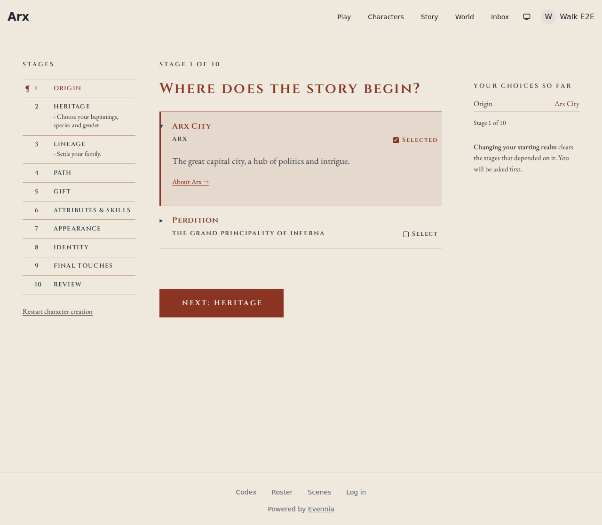
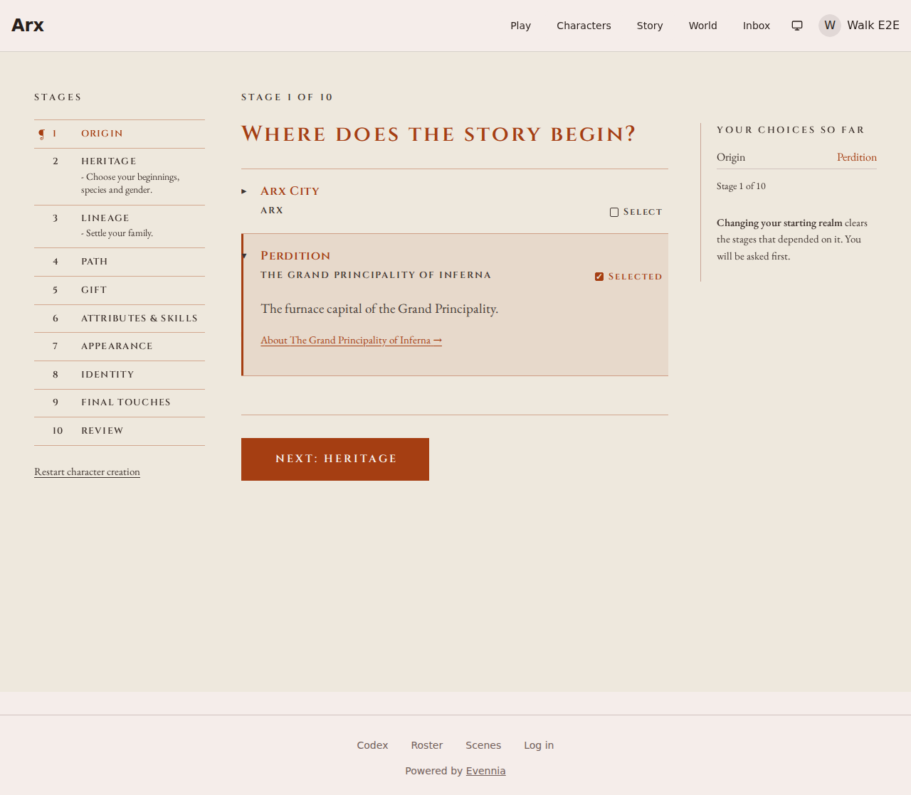
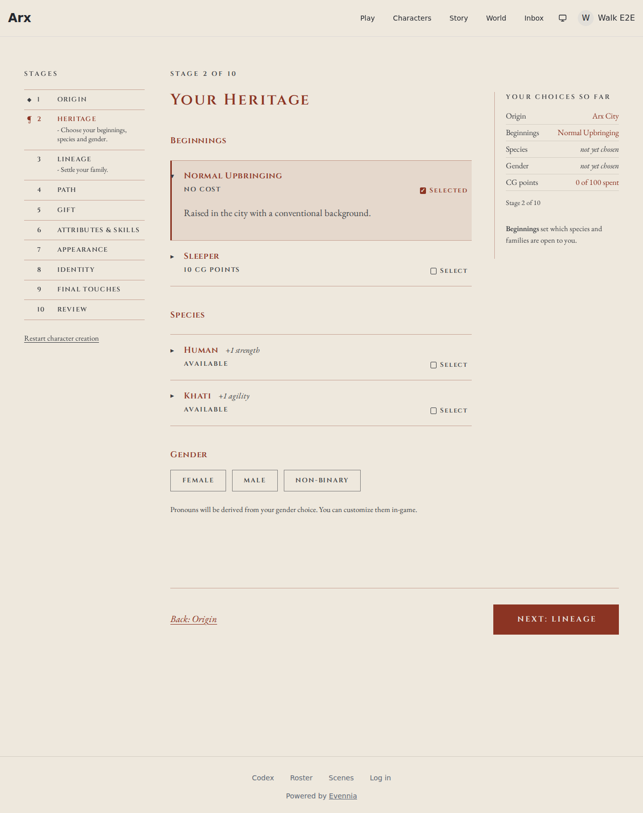
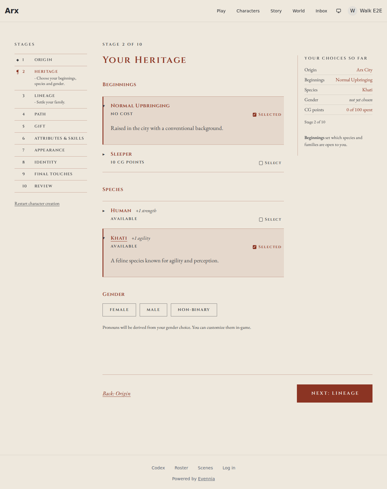
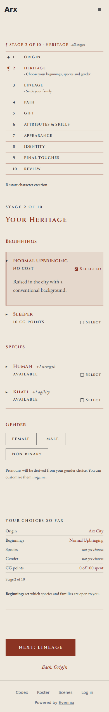

# Review evidence

- Reviewed revision: `c0609ed1263962e92ea084a2d677eb81024a618e`
- Reviewer: `migration-reviewer` (dispatched on 0160) plus the authoring agent for the visual comparison against the maintainer's walkthrough notes in #4022
- Reviewer verdict: PASS
- Application/build identity: production bundle (`pnpm build`, Vite 6) served by `vite preview` on port 4173 through Playwright 1.58.2, branch `feature-4022-cg-walkthrough-pass-1-realm-confirm-only`
- Environment: Linux devcontainer, headless Chromium 1208, every `/api/**` call answered by fixtures shaped like the CG serializers (`frontend/e2e/evidence/cg-pass1-4022.spec.ts`); backend on the SQLite fast tier
- Viewports/themes: 1280 light (Arx and Inferna realm tints), 390 light
- Approved design: https://github.com/Arx-Game/arxii/issues/4022 (spec text; the maintainer's rulings in chat, no demo page)
- Visual review: Completed
- Visual verdict: PASS
- Screenshots:     
- Comparison notes: each of the maintainer's notes checked against the captures. Origin: changing the realm with no beginnings, species or family chosen goes straight through with no "Change Starting Realm" dialog; the marginal note still explains that dependent stages would be cleared. Rail: notes read "- Choose your beginnings, species and gender." in regular text, no "n.b.", no italics. Heritage: the heading reads "Gender" and the options are Female, Male, Non-Binary. Every entry has a square Select mark in its name row that reads a checked Selected once chosen; the chosen row carries the realm-accent wash and left rule with the name in accent (the Inferna capture shows the tint following the realm); the foot's "Selected." sentence is gone. At 390px the mark stays on the tag line and the gender options wrap. No discrepancies.
- Tested interactions: Origin loads with the chosen realm marked Selected; pressing another realm's Select mark changes the realm with no dialog and the rail updates; Heritage shows the chosen beginning marked Selected and the others offering Select; pressing Khati's Select mark chooses the species, marks it Selected and tints its row; no page errors. Unit tests cover the confirm still appearing when a dependent choice exists, Cancel and Clear paths, a second press on the mark clearing, and a non-clearable choice showing an inert mark.
- Fixture/live boundary: the browser drove the real production bundle (real CG page, stages, rail and entries); the API was fixtures. The gender endpoint filtering and draft validation were proven against the real Django viewset and serializer in `world.character_creation.tests.test_gender_options`, not in the browser.
- Overall outcome: PASS

## Visual checklist

| Element | Expected | Result | Evidence |
|---|---|---|---|
| Realm change with nothing dependent | No confirm dialog; realm changes at once | MATCH | origin-changed-no-confirm-1280.png |
| Rail requirement note | Hyphen, regular text, no n.b., no italics | MATCH | origin-chosen-1280.png |
| Gender heading and options | "Gender"; Female, Male, Non-Binary | MATCH | heritage-1280.png |
| Select mark in the name row | Square mark reading Select, checked Selected once chosen | MATCH | heritage-1280.png, heritage-species-chosen-1280.png |
| Chosen row tint | Realm-accent wash, left rule, accent name | MATCH | heritage-species-chosen-1280.png, origin-changed-no-confirm-1280.png |
| Foot door | One button, no "Selected." sentence | MATCH | Playwright assertion that "Selected." is absent in `cg-pass1-4022.spec.ts` |
| Phone width | Mark on the tag line, gender options wrap | MATCH | heritage-390.png |

## Requirement ledger

| ID | Status | Evidence | Authorized decision |
|---|---|---|---|
| A01 | PASS | `OriginStage.test.tsx`: no confirm without dependents, confirm with them | |
| A02 | PASS | `ContentsRail.test.tsx`: note text is exactly "- reason", no `.nb` element | |
| A03 | PASS | `folio.test.tsx`: mark chooses without opening the entry, reads Selected and clears on a second press, inert when the choice cannot be cleared; all ten picker call sites wired | |
| A04 | PASS | `world.character_creation.tests.test_gender_options`: the gender list holds only selectable rows, the draft refuses a non-selectable gender; `world.seeds.tests.test_cg_seed_gaps` seeds exactly Male, Female, Non-Binary | |
| A05 | PASS | migration-reviewer on 0160: schema-only, deliberate discard of the unread `is_default` (ADR-0237), leaf follows main's tip 0159, no blocking findings | |
| A06 | PASS | character-creation Vitest suite 349 tests green; `pnpm typecheck`, eslint and prettier clean; `ty check` clean; SQLite tier for `world.character_sheets.tests`, the gender tests and the seed tests: 398 OK | |

## Unresolved findings

- None
