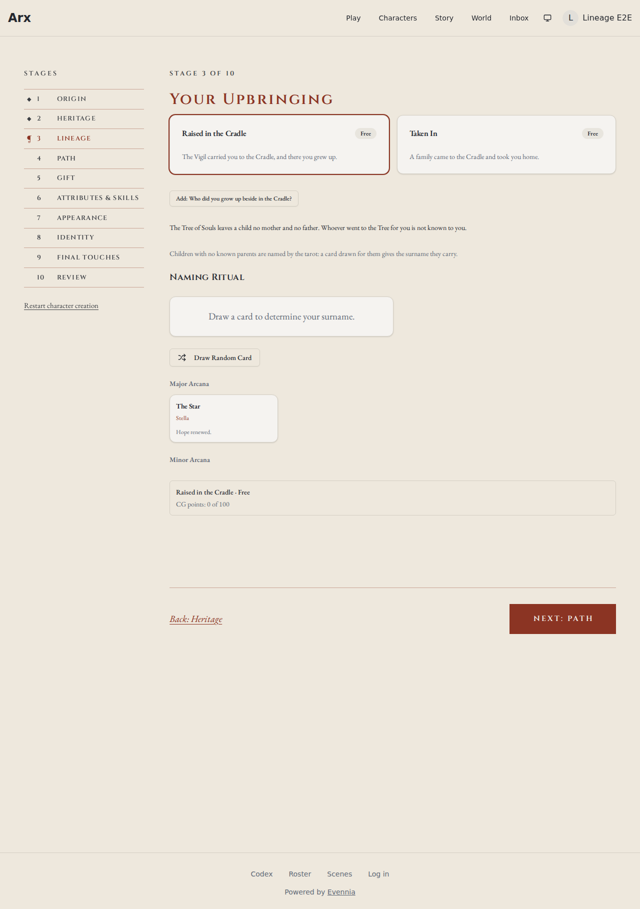
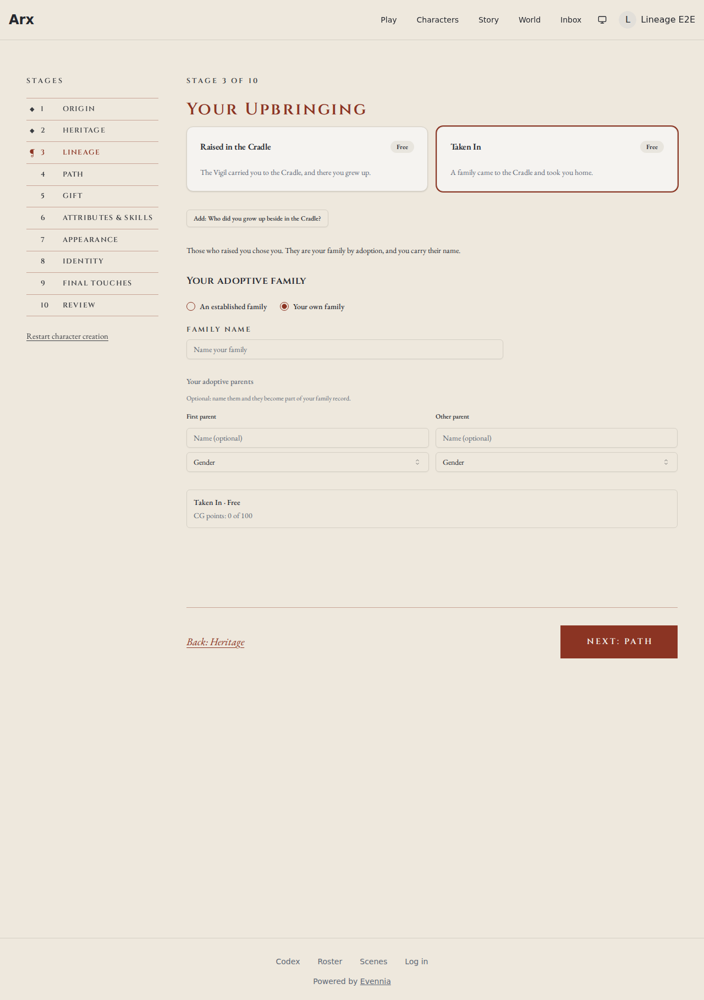
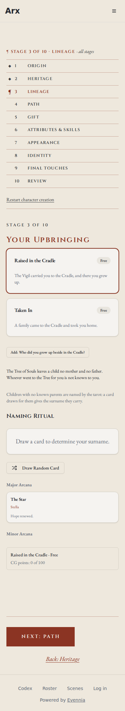

# Review evidence

- Reviewed revision: `95322653ce63a3425d26e1b27bec241a03136b49`
- Reviewer: `migration-reviewer` (dispatched on 0161) plus the authoring agent for the visual comparison against the approved spec on #4024
- Reviewer verdict: PASS
- Application/build identity: production bundle (`pnpm build`, Vite 6) served by `vite preview` on port 4173 through Playwright 1.58.2, branch `feature-4024-cg-lineage-upbringing-parentage`
- Environment: Linux devcontainer, headless Chromium 1208; every `/api/**` call answered by fixtures shaped like the CG serializers (`frontend/e2e/evidence/cg-parentage-4024.spec.ts`); backend on the SQLite fast tier
- Viewports/themes: 1280 light, 390 light
- Approved design: https://github.com/Arx-Game/arxii/issues/4024 (approved spec; no demo page)
- Visual review: Completed
- Visual verdict: PASS
- Screenshots:   
- Comparison notes: walkthrough steps checked against the captures. Raised in the Cradle (no known parents): the Upbringing's parentage note, then the tarot ritual introduced by the `tarot_no_parents_intro` copy; no family heading, no parents card. Taken In (adoptive): the note, the family section under the adoptive heading, the choice reading "An established family" / "Your own family" with your own selected and the family-name field open, and the parents card titled "Your adoptive parents". The first adoptive capture showed the parents card still offering "Line parent (your species)" and a species picker for the other parent, which feed heredity; that was fixed (461adad87) and recaptured: "First parent", no species line or picker. The question chip shown on both Upbringings is the shared fixture question, not a product behaviour. Service is not visible because the fixture offers no retainer positions.
- Tested interactions: the Cradle Upbringing renders its note, the explained tarot and no family or parents; Taken In renders the adoptive heading, your own family preselected, the adoptive parents card without heredity controls; no page errors. Unit and API tests cover the model `clean()` rules, the serializer fields, the your-own default, the builder saving and refusing parentage, finalize writing ADOPTIVE links and an ADOPTED membership, no parents for no known parents, and no heredity lines or pins for an adoptive draft.
- Fixture/live boundary: the browser drove the real production bundle (real CG page, Lineage stage, Upbringing picker, family section, tarot ritual); the API was fixtures. Finalize, validation, the builder and the migration were exercised against the real Django code on SQLite.
- Overall outcome: PASS

## Visual checklist

| Element | Expected | Result | Evidence |
|---|---|---|---|
| Parentage note | The Upbringing's note below its questions | MATCH | cradle-no-known-parents-1280.png, taken-in-adoptive-1280.png |
| No known parents | Explained tarot ritual; no family heading or parents | MATCH | cradle-no-known-parents-1280.png |
| Adoptive heading | Family section headed as adoptive | MATCH | taken-in-adoptive-1280.png |
| Family choice | "An established family" / "Your own family", your own open by default | MATCH | taken-in-adoptive-1280.png |
| Adoptive parents card | "Your adoptive parents", no species line or picker | MATCH | taken-in-adoptive-1280.png |
| Phone width | Note, intro and ritual stack in the column | MATCH | cradle-390.png |

## Requirement ledger

| ID | Status | Evidence | Authorized decision |
|---|---|---|---|
| A01 | PASS | `world.character_creation.tests.test_upbringing_parentage` (13 tests): clean rules, serializer, your-own default, adoptive finalize (ADOPTIVE edges, ADOPTED membership), no parents for no known parents, no heredity lines for adoptive | |
| A02 | PASS | `web.admin.tests.test_upbringing_builder` (57 tests): builder saves parentage and its note, refuses adoptive with only no family on the field | |
| A03 | PASS | `world.character_creation` suite 696 tests OK after updating the two tests that pinned the old nothing-chosen behaviour; heredity tests green | |
| A04 | PASS | `LineageStage.test.tsx` (32 tests) and the whole character-creation Vitest suite (353 tests) green; `pnpm typecheck`, eslint and prettier clean; `ty check` clean | |
| A05 | PASS | migration-reviewer on 0161: schema-only, defaults backfill every row, leaf follows main's tip 0160; its one finding (classify `parentage_note` as prose) fixed, which also puts the note in the authoring workbench | |
| A06 | PASS | API types regenerated (`just gen-api-types`), diff scoped to the two fields | |

## Unresolved findings

- None
