# Review evidence

- Reviewed revision: `89baa18040b448619cd8ffec3aa9a07eb3238044`
- Reviewer: demo-fidelity-reviewer agent
- Reviewer verdict: PASS
- Application/build identity: Vite 6.4.3 dev server (throwaway scratchpad harness, nothing added to the repo) serving the real StandoffCard and CombatTurnPanel from the worktree frontend/src at 89baa1804, compiled with the worktree Tailwind, PostCSS and src/index.css; telnet from live CmdStandoff and build_standoff_view via a scratch test on factory rows
- Environment: Linux devcontainer, headless Chromium via the worktree @playwright/test, html data-realm default without the dark class, Google Fonts unreachable so demo and app share the same local serif fallback
- Viewports/themes: 1280x1000 viewport, light colour scheme, card rendered at 280px (play sidebar rail) and 1040px (demo column); demo forced to data-theme light
- Approved design: https://claude.ai/artifact/PHUgGBC2Cus5no5FEdhQqE, reviewed from the local copy .superpowers/sdd/2026-10-04-standoffs-slice1/demo.html (identity with the artifact is the implementer's statement); Screens 1, 2, 3 and 5 in scope, Screen 4 out of scope
- Visual review: Completed
- Visual verdict: PASS
- Screenshots:                           
- Comparison notes: Rendered app compared with demo Screens 1, 2, 3 and 5 at 280px and 1040px light; every in-scope element matches or is ratified; the second-pass hover defect H1 is fixed (muted hover fill, unchanged text colours, 2px focus ring); remaining non-blocking gaps G1, G2, G3, G5, N1, N2 are listed below
- Tested interactions: hover and keyboard focus on an approach row, the Read row and a terms row at both widths; Look for select then Read them again dispatching standoff_read with focus_kind cause; Let us pass opening the confirm panel; Spin dispatching standoff_terms; Keep pressing closing the confirm without dispatch; Threaten, Share and Fight dispatches; overflow probe at both widths
- Fixture/live boundary: web card and combat panel rendered from hand-built StandoffView and EncounterDetail fixtures in the generated API shape, with all API calls intercepted by Playwright; telnet output from live service code on factory rows; terms success message verified by world.standoffs.tests.test_verbs at HEAD
- Overall outcome: PASS

Summary: **Verdict: PASS.** The one second-pass defect (H1, option rows unreadable on hover) is fixed at `89baa1804`. Hovered rows now take the muted fill and keep their own text colours, and keyboard focus draws a visible ring. Both were rendered and measured at 280px and 1040px. The same commit also closes minor gaps G4 (Read row label), G6 (telnet terms text) and G7 (panel header). What remains is minor and does not block: G1, G2, G3, G5, the muted-caption contrast note N1, and the doubled "Standoff" heading N2.

## Visual checklist

Compared by a vision-capable reviewer, rendered app against the demo, light theme, at 280px
and 1040px. Demo annotation chrome is excluded. Ratified departures and accepted minor gaps
are listed in their own sections, not here.

| Element | Expected | Result | Evidence |
|---|---|---|---|
| Screen 1: spark panel | Tinted 'Your spark here' panel, bold spark text, 'How, you don't know yet. A read could tell you.', share control | MATCH | [app-screen1-arrival-rail280.png](docs/reviews/4145/app-screen1-arrival-rail280.png), [app-screen1-arrival-wide1040.png](docs/reviews/4145/app-screen1-arrival-wide1040.png), [demo-screen1-arrival.png](docs/reviews/4145/demo-screen1-arrival.png) |
| Screen 1: group header | 'Roadside Bandits' with a x4 count | MATCH | [app-screen1-arrival-rail280.png](docs/reviews/4145/app-screen1-arrival-rail280.png), [app-screen1-arrival-wide1040.png](docs/reviews/4145/app-screen1-arrival-wide1040.png) |
| Screen 1: face-down cards | Three hatched 92x118 face-down cards | MATCH | [app-screen1-arrival-rail280.png](docs/reviews/4145/app-screen1-arrival-rail280.png), [app-screen1-arrival-wide1040.png](docs/reviews/4145/app-screen1-arrival-wide1040.png) |
| Screen 1: layout | Group on the left, options on the right at 1040px; stacked at the 280px rail | MATCH | [app-screen1-arrival-rail280.png](docs/reviews/4145/app-screen1-arrival-rail280.png), [app-screen1-arrival-wide1040.png](docs/reviews/4145/app-screen1-arrival-wide1040.png) |
| Screen 1: Read row | 'Read them', Insight caption, 'reveals by success level', Moderate grade | MATCH | [app-screen1-arrival-rail280.png](docs/reviews/4145/app-screen1-arrival-rail280.png), [app-screen1-arrival-wide1040.png](docs/reviews/4145/app-screen1-arrival-wide1040.png) |
| Screen 1: approach rows | Threaten, Bribe, Charm, Deceive with check captions | MATCH | [app-screen1-arrival-rail280.png](docs/reviews/4145/app-screen1-arrival-rail280.png), [app-screen1-arrival-wide1040.png](docs/reviews/4145/app-screen1-arrival-wide1040.png) |
| Screen 1: grades | Monospace grade labels, amber Moderate, red Hard | MATCH | [app-screen1-arrival-rail280.png](docs/reviews/4145/app-screen1-arrival-rail280.png), [app-screen1-arrival-wide1040.png](docs/reviews/4145/app-screen1-arrival-wide1040.png) |
| Screen 1: terms entry | 'Name your terms' with graded terms | MATCH | [app-screen1-arrival-rail280.png](docs/reviews/4145/app-screen1-arrival-rail280.png), [app-screen1-arrival-wide1040.png](docs/reviews/4145/app-screen1-arrival-wide1040.png) |
| Screen 1: Fight row | Danger-outlined Fight row, 'starts round one' | MATCH | [app-screen1-arrival-rail280.png](docs/reviews/4145/app-screen1-arrival-rail280.png), [app-screen1-arrival-wide1040.png](docs/reviews/4145/app-screen1-arrival-wide1040.png) |
| Screen 2: cause card | Red dashed card, Predation, 'cause', gloss | MATCH | [app-screen2-pressed-rail280.png](docs/reviews/4145/app-screen2-pressed-rail280.png), [app-screen2-pressed-wide1040.png](docs/reviews/4145/app-screen2-pressed-wide1040.png), [demo-screen2-read-press.png](docs/reviews/4145/demo-screen2-read-press.png) |
| Screen 2: drive card | Accent-bordered card, Fearful, Minor | MATCH | [app-screen2-pressed-rail280.png](docs/reviews/4145/app-screen2-pressed-rail280.png), [app-screen2-pressed-wide1040.png](docs/reviews/4145/app-screen2-pressed-wide1040.png) |
| Screen 2: remaining face-down card | One face-down card left | MATCH | [app-screen2-pressed-rail280.png](docs/reviews/4145/app-screen2-pressed-rail280.png), [app-screen2-pressed-wide1040.png](docs/reviews/4145/app-screen2-pressed-wide1040.png) |
| Screen 2: hit row | Accent border and inset bar, 'hits Fearful', Easy | MATCH | [app-screen2-pressed-rail280.png](docs/reviews/4145/app-screen2-pressed-rail280.png), [app-screen2-pressed-wide1040.png](docs/reviews/4145/app-screen2-pressed-wide1040.png) |
| Screen 2: spark lever | Spark lever line on the hit row | MATCH | [app-screen2-pressed-rail280.png](docs/reviews/4145/app-screen2-pressed-rail280.png), [app-screen2-pressed-wide1040.png](docs/reviews/4145/app-screen2-pressed-wide1040.png) |
| Screen 2: Bribe row | 'Bribe', 'no known lever', Moderate | MATCH | [app-screen2-pressed-rail280.png](docs/reviews/4145/app-screen2-pressed-rail280.png), [app-screen2-pressed-wide1040.png](docs/reviews/4145/app-screen2-pressed-wide1040.png) |
| Screen 2: Read them again | Read row relabelled 'Read them again' after a reveal | MATCH | [app-screen2-pressed-rail280.png](docs/reviews/4145/app-screen2-pressed-rail280.png), [app-screen2-pressed-wide1040.png](docs/reviews/4145/app-screen2-pressed-wide1040.png), [app-interaction-read-rail280.png](docs/reviews/4145/app-interaction-read-rail280.png) |
| Screen 2: terms eased | Terms graded easier after presses | MATCH | [app-screen2-pressed-rail280.png](docs/reviews/4145/app-screen2-pressed-rail280.png), [app-screen2-pressed-wide1040.png](docs/reviews/4145/app-screen2-pressed-wide1040.png) |
| Screen 3: terms prompt | 'Name your terms', presses make this easier | MATCH | [app-screen3-terms-confirm-rail280.png](docs/reviews/4145/app-screen3-terms-confirm-rail280.png), [app-screen3-terms-confirm-wide1040.png](docs/reviews/4145/app-screen3-terms-confirm-wide1040.png), [demo-screen3-terms.png](docs/reviews/4145/demo-screen3-terms.png) |
| Screen 3: chosen term description | Outcome description 'They step aside. You cross unharmed.' | MATCH | [app-screen3-terms-confirm-rail280.png](docs/reviews/4145/app-screen3-terms-confirm-rail280.png), [app-screen3-terms-confirm-wide1040.png](docs/reviews/4145/app-screen3-terms-confirm-wide1040.png) |
| Screen 3: confirm buttons | Primary 'Spin for "Let us pass"' and outline 'Keep pressing' | MATCH | [app-screen3-terms-confirm-rail280.png](docs/reviews/4145/app-screen3-terms-confirm-rail280.png), [app-screen3-terms-confirm-wide1040.png](docs/reviews/4145/app-screen3-terms-confirm-wide1040.png) |
| Screen 5: telnet header | Place and group header | MATCH | [app-screen5-telnet.png](docs/reviews/4145/app-screen5-telnet.png), [demo-screen5-telnet.png](docs/reviews/4145/demo-screen5-telnet.png) |
| Screen 5: telnet spark and options | Spark line and graded options line | MATCH | [app-screen5-telnet.png](docs/reviews/4145/app-screen5-telnet.png) |
| Panel during a standoff | Only the standoff shown, round sections hidden, header 'Standoff' | MATCH | [app-panel-standoff-rail280.png](docs/reviews/4145/app-panel-standoff-rail280.png), [app-panel-standoff-wide1040.png](docs/reviews/4145/app-panel-standoff-wide1040.png) |
| Option row hover | Row stays legible on hover; text keeps its colours | MATCH | [app-hover-approach-hit-threaten-rail280.png](docs/reviews/4145/app-hover-approach-hit-threaten-rail280.png), [app-hover-approach-hit-threaten-wide1040.png](docs/reviews/4145/app-hover-approach-hit-threaten-wide1040.png), [app-hover-read-rail280.png](docs/reviews/4145/app-hover-read-rail280.png), [app-hover-read-wide1040.png](docs/reviews/4145/app-hover-read-wide1040.png), [app-hover-terms-rail280.png](docs/reviews/4145/app-hover-terms-rail280.png), [app-hover-terms-wide1040.png](docs/reviews/4145/app-hover-terms-wide1040.png), [app-hover-bribe-rail280.png](docs/reviews/4145/app-hover-bribe-rail280.png) |
| Option row keyboard focus | Visible focus ring on approach, Read and terms rows | MATCH | [app-focus-approach-hit-threaten-rail280.png](docs/reviews/4145/app-focus-approach-hit-threaten-rail280.png), [app-focus-approach-hit-threaten-wide1040.png](docs/reviews/4145/app-focus-approach-hit-threaten-wide1040.png), [app-focus-read-rail280.png](docs/reviews/4145/app-focus-read-rail280.png), [app-focus-read-wide1040.png](docs/reviews/4145/app-focus-read-wide1040.png), [app-focus-terms-rail280.png](docs/reviews/4145/app-focus-terms-rail280.png), [app-focus-terms-wide1040.png](docs/reviews/4145/app-focus-terms-wide1040.png) |

## Ratified decisions

1. The reaction line and the level-band caption ("an even match") are omitted. There is no
   data source for either, and the band has to be earned by a check.
2. The cause and drives start hidden. Face-down tiles carry no `cause` / `drive` label.
3. Terms ease is shown as a count ("2 steps easier so far"), not as pips.
4. Owner-only options live on the mission BeatCard as "because" reasons. Not re-rendered in
   this pass: BeatCard is unchanged since the first pass.
5. Players see no morale on the Fight row. Morale is GM-only on the server.
6. The mission flavor line stays on the mission BeatCard.
7. The cause gloss is placeholder text, one per cause kind.
8. Telnet uses `standoff <subverb>`, per spec section 10.

## Accepted minor gaps (non-blocking)

- **G1.** "no known lever" shows on every row at arrival. The demo shows it only after a read.
- **G2.** No persistent "X read them: level" line on the card for the party; the reader gets a toast.
- **G3.** The hit row does not say how strongly the modifier counts ("Menace counts twice").
- **G5.** Term descriptions show only after a term is picked, not on every term up front.
- **N1.** The shared muted caption token measures 4.4:1 at rest and 3.8:1 on the hover fill,
  under 4.5:1 for small text. It is app-wide and not introduced by this branch; text stays
  readable in the screenshots.
- **N2.** In the combat panel the header "Standoff" sits directly above the card's own
  "Standoff at Harrow Bridge". Redundant, harmless.

## Requirement ledger

| ID | Status | Evidence | Authorized decision |
|---|---|---|---|
| S1-arrival | PASS | Screen 1 Arrival matches the demo: [app-screen1-arrival-rail280.png](docs/reviews/4145/app-screen1-arrival-rail280.png), [app-screen1-arrival-wide1040.png](docs/reviews/4145/app-screen1-arrival-wide1040.png) |  |
| S2-read-press | PASS | Screen 2 Read and press matches the demo: [app-screen2-pressed-rail280.png](docs/reviews/4145/app-screen2-pressed-rail280.png), [app-screen2-pressed-wide1040.png](docs/reviews/4145/app-screen2-pressed-wide1040.png) |  |
| S3-terms | PASS | Screen 3 Terms matches the demo, confirm step dispatches standoff_terms and Keep pressing backs out: [app-screen3-terms-confirm-rail280.png](docs/reviews/4145/app-screen3-terms-confirm-rail280.png), [app-screen3-terms-confirm-wide1040.png](docs/reviews/4145/app-screen3-terms-confirm-wide1040.png) |  |
| S5-telnet | PASS | Screen 5 Telnet matches the demo; terms text verified by world.standoffs.tests.test_verbs at HEAD (5 tests OK): [app-screen5-telnet.png](docs/reviews/4145/app-screen5-telnet.png) |  |
| S4-gm-rail | OUT_OF_SCOPE | Out of scope for slice 1 per the spec | Spec scope: slice 1 covers Screens 1, 2, 3 and 5 only |
| P-panel | PASS | Combat panel shows only the standoff with a Standoff header: [app-panel-standoff-rail280.png](docs/reviews/4145/app-panel-standoff-rail280.png), [app-panel-standoff-wide1040.png](docs/reviews/4145/app-panel-standoff-wide1040.png) |  |
| H1-hover | PASS | Option rows legible on hover and focus at 280 and 1040: [app-hover-approach-hit-threaten-rail280.png](docs/reviews/4145/app-hover-approach-hit-threaten-rail280.png), [app-focus-read-wide1040.png](docs/reviews/4145/app-focus-read-wide1040.png) |  |
| CSS-reach | PASS | Rules reach the page: Tailwind utilities and the imported standoff.css render (hatch, tile size, container-query columns): [app-screen1-arrival-wide1040.png](docs/reviews/4145/app-screen1-arrival-wide1040.png), [app-screen2-pressed-rail280.png](docs/reviews/4145/app-screen2-pressed-rail280.png) |  |
| Host-contract | PASS | Realm tokens and the shared Button and Select components are used: [app-screen2-pressed-wide1040.png](docs/reviews/4145/app-screen2-pressed-wide1040.png) |  |
| Demo-read | PASS | Approved demo reached and read (local copy of the artifact): .superpowers/sdd/2026-10-04-standoffs-slice1/demo.html |  |

## Unresolved findings

- None

## Detailed report

## What was reviewed

| Item | Value |
|---|---|
| Reviewed commit | `89baa18040b448619cd8ffec3aa9a07eb3238044` (branch `feature-4121-why-npcs-fight-motivation-avoiding-fight`, HEAD). Fix commits since the first pass: `e2410d63f` (payload), `731abc107` (card), `89baa1804` (hover, focus, header, Read label, terms message). Every app screenshot below was re-rendered at this commit. |
| Approved design | https://claude.ai/artifact/PHUgGBC2Cus5no5FEdhQqE, reviewed from the local copy `.superpowers/sdd/2026-10-04-standoffs-slice1/demo.html`. The implementer states the copy is identical to the artifact; this reviewer did not check that. In scope: Screens 1, 2, 3 and 5. Screen 4 (GM rail) is out of scope. |
| Build identity | Vite 6.4.3 dev server serving the real `StandoffCard` and `CombatTurnPanel` from the worktree's `frontend/src`, compiled through the worktree's own Tailwind and PostCSS config and `src/index.css`. `standoff.css` is imported by the component, so its rules reach the page. The harness lived only in the session scratchpad. Nothing was added to the repo. |
| Browser | Headless Chromium via the worktree's `@playwright/test` |
| Viewport / theme | 1280x1000 viewport, `colorScheme: light`. `<html data-realm="default">` with no `.dark` class (the warm realm palette). The demo was forced to `data-theme="light"`. |
| Card widths | **280px**: the default play-sidebar width, which is the width players actually get. **1040px**: the demo's column width. |
| Fonts | Google Fonts cannot be reached from the container. Both the demo and the app fell back to the same local serif. |
| Telnet | Rendered by a throwaway test module in the scratchpad (not the repo), run with `just test-fast <scratch dir>`. It subclasses `CmdStandoffTests`, so it uses real factories and the live `CmdStandoff` and `build_standoff_view`. |

### Fixture versus live

- **Web card: fixture.** A hand-built `StandoffView` in the generated API shape (`place`,
  `grade_label`, `check_caption`, `hits_revealed_drive`, `cause_gloss`, `read_check`,
  `read_grade_label` and terms `description` included), rendered by the real component.
  Arrival: one group of 4, `hidden_count` 3, the viewer's own spark, 4 approaches, 2 terms.
  Pressed: cause Predation revealed with its gloss, Fearful (Minor) revealed, `hidden_count`
  1, `terms_ease` 2, the regard line revealed, and Threaten as the hit row with levers in the
  server's format (`hits Fearful (Minor)`, `your spark: ...`).
- **Combat panel: fixture.** The real `CombatTurnPanel`. Playwright served
  `/api/combat/1/` an `EncounterDetail` with `round_number` 0 and the pressed standoff, and
  answered every other API call with `[]`.
- **Dispatch: intercepted.** The request bodies the card sent were captured. They are
  listed below.
- **Telnet: live service code** on factory rows. The transcript image was captured at `731abc107`. `89baa1804` changes only the terms success message, which does not appear in the transcript. That change was checked by running `world.standoffs.tests.test_verbs.TermsDescriptionMessageTests` and `ResultMessageTests` at HEAD (5 tests, OK). "Impossible" grades come from the factory
  character having no stats, not from a defect. No terms line appears because the fixture has
  no terms check type configured.

### Interactions tested

| Action | Result |
|---|---|
| Click "Let us pass" (280 and 1040) | Opens the confirm panel. It shows the description "They step aside. You cross unharmed." with **Spin for "Let us pass"** and **Keep pressing** ([280](4145/app-screen3-terms-confirm-rail280.png), [1040](4145/app-screen3-terms-confirm-wide1040.png)). Nothing is dispatched yet. |
| Spin for "Let us pass" | `standoff_terms` `{"group_id":11,"terms_id":31}` |
| Keep pressing | Closes the confirm panel (0 confirm panels left) and dispatches nothing |
| Look for "Why would they fight?" then Read them again (280) | `standoff_read` `{"group_id":11,"focus_kind":"cause"}`. The select value fits on one line ([screenshot](4145/app-interaction-read-rail280.png)). |
| Read row label | "Read them" at arrival. "Read them again" once a cause, drive or regard line is revealed (both widths). |
| Hover an approach row, the Read row and a terms row (280 and 1040) | The fill becomes `rgb(235,233,229)` (muted). Text colours do not change. Measured contrast against the fill: title 12.3:1; grades Moderate 4.1:1, Easy 4.5:1; italic lever 4.8:1; muted caption 3.8:1 (N1). The hit row keeps its accent border and inset bar. Screenshots: Threaten [280](4145/app-hover-approach-hit-threaten-rail280.png) / [1040](4145/app-hover-approach-hit-threaten-wide1040.png), Read [280](4145/app-hover-read-rail280.png) / [1040](4145/app-hover-read-wide1040.png), terms [280](4145/app-hover-terms-rail280.png) / [1040](4145/app-hover-terms-wide1040.png), Bribe [280](4145/app-hover-bribe-rail280.png). H1 is fixed. |
| Keyboard focus on the same rows (280 and 1040) | `:focus-visible` is true. A 2px ring in `rgb(148,114,56)` is drawn around the row, and the background stays at rest. Contrast at rest: title 14.1:1, grades 4.7 to 5.2:1, caption 4.4:1. Screenshots: Threaten [280](4145/app-focus-approach-hit-threaten-rail280.png) / [1040](4145/app-focus-approach-hit-threaten-wide1040.png), Read [280](4145/app-focus-read-rail280.png) / [1040](4145/app-focus-read-wide1040.png), terms [280](4145/app-focus-terms-rail280.png) / [1040](4145/app-focus-terms-wide1040.png). |
| Overflow probe | At both widths and in both states, no element inside the card has `scrollWidth > clientWidth` |
| Combat panel during a standoff | The panel `h2` reads "Standoff" at both widths. The only testid outside the card is `combat-turn-panel`. YourTurn, ResonanceBudget, VitalPools, CombatantsList, CompanionOrders, ActiveState and RoundFlow are all absent ([280](4145/app-panel-standoff-rail280.png), [1040](4145/app-panel-standoff-wide1040.png)). |

## Screenshots

All screenshots are in `docs/reviews/4145/`.

| Screen | Demo (approved) | Build |
|---|---|---|
| 1 Arrival | 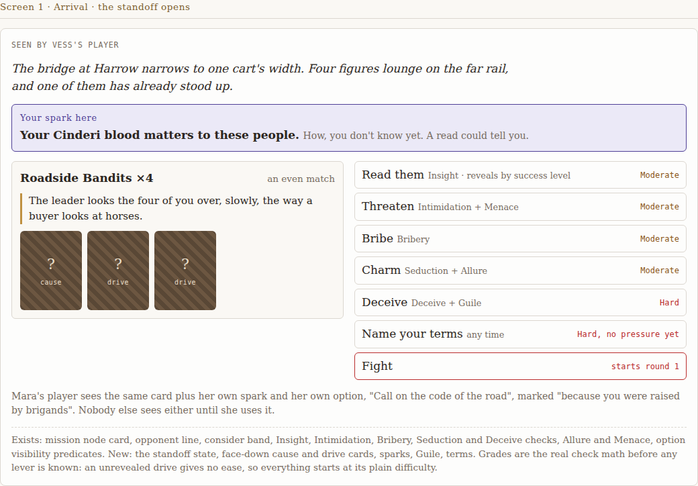 | 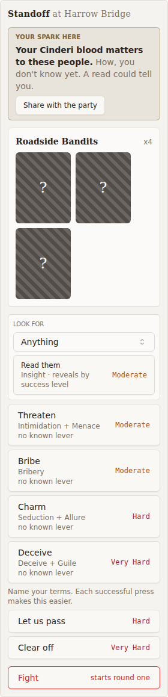 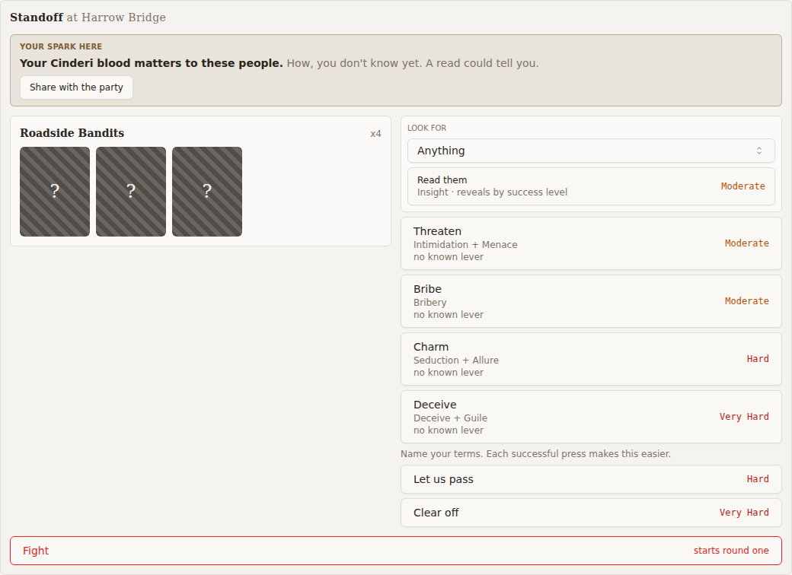 |
| 2 Read and press | 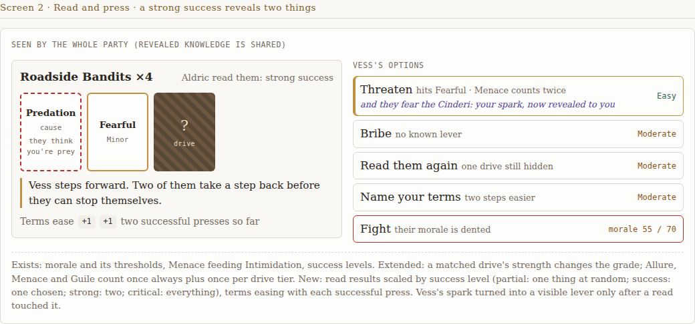 | 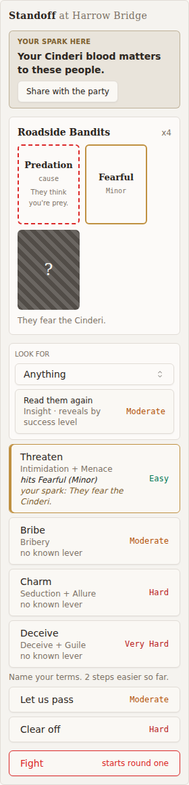 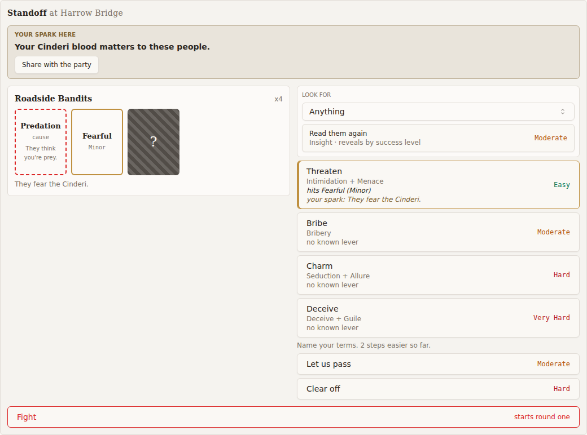 |
| 3 Terms | 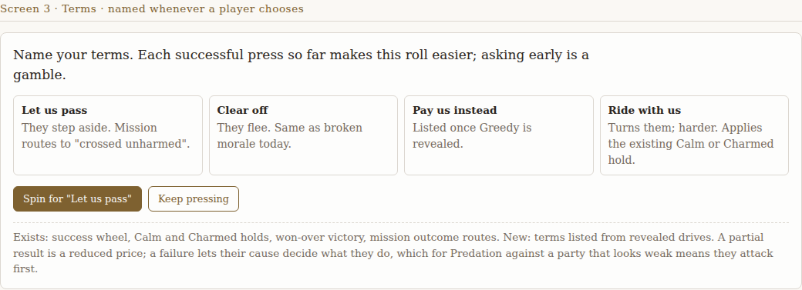 | 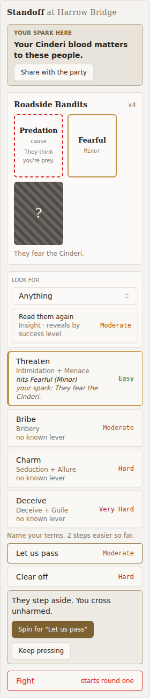 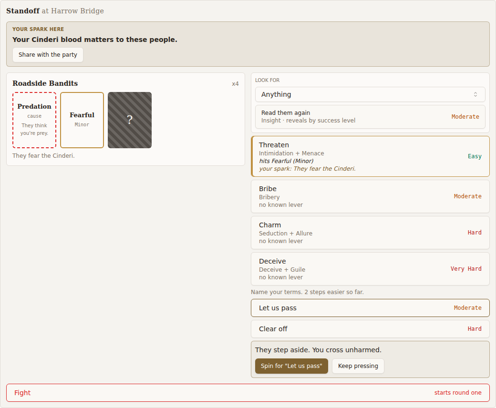 |
| 5 Telnet | 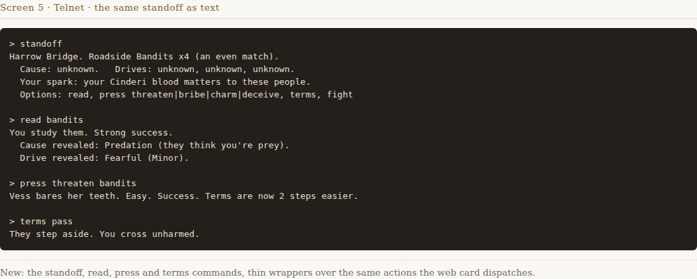 | 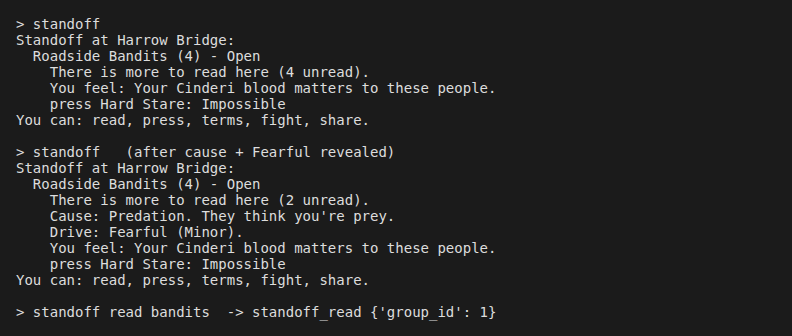 ([text](4145/app-screen5-telnet.txt)) |
| Panel in a standoff | n/a | 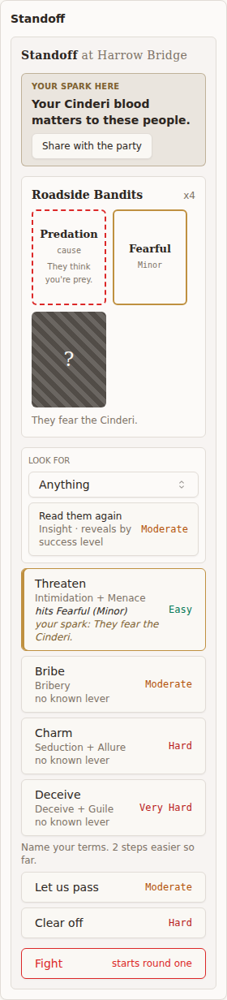 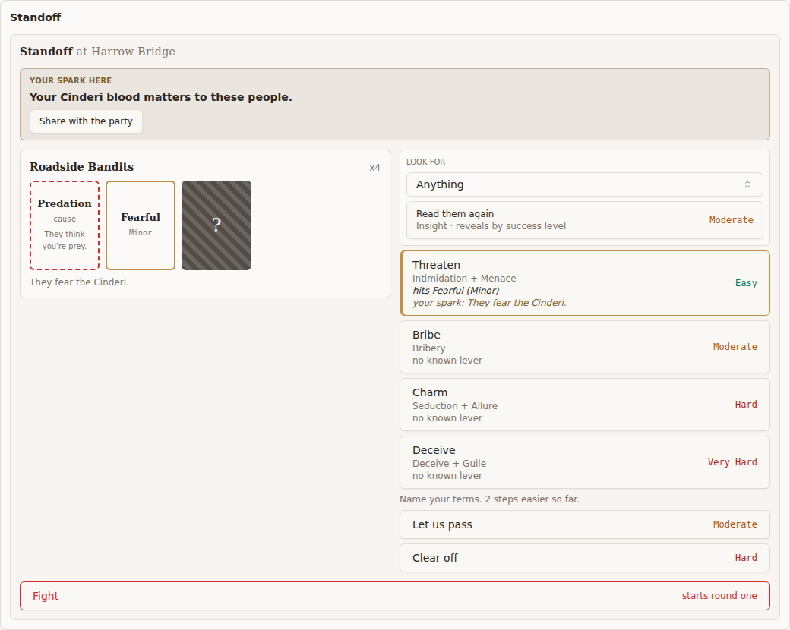 |
| Interactions | n/a | 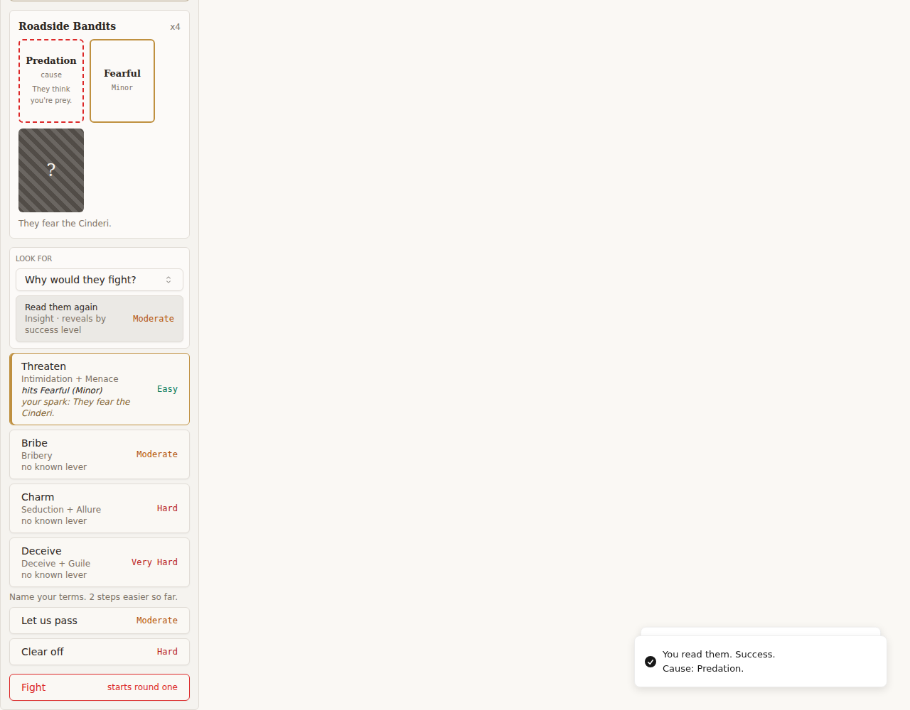 |
| Hover (the demo has no hover state) | n/a | 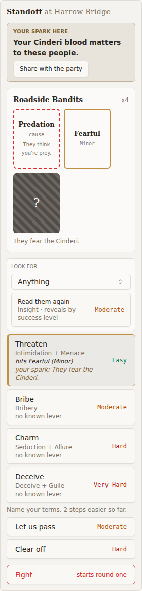 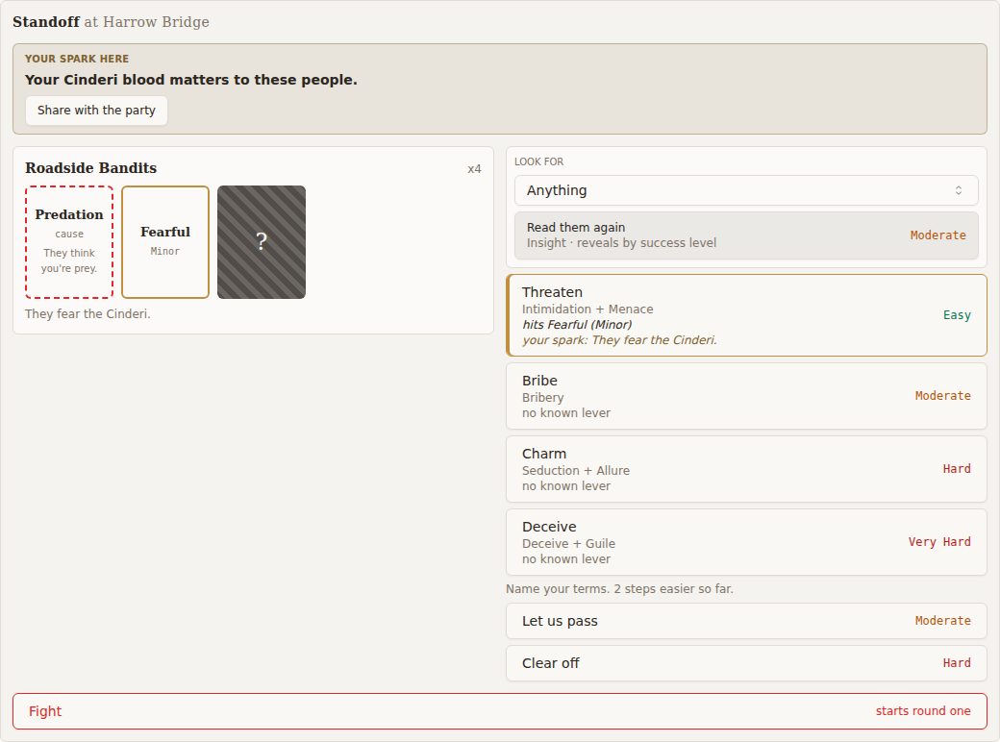  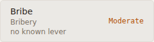 |
| Focus (the demo has no focus state) | n/a | 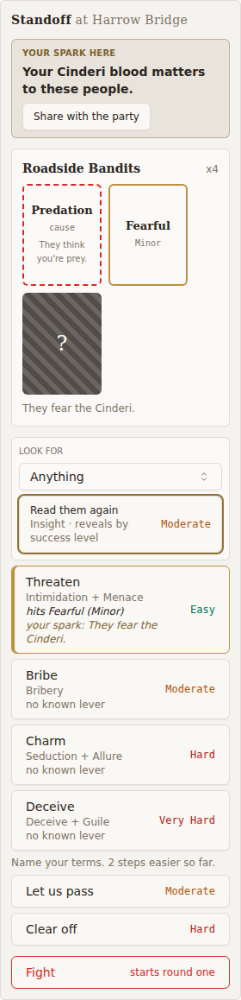 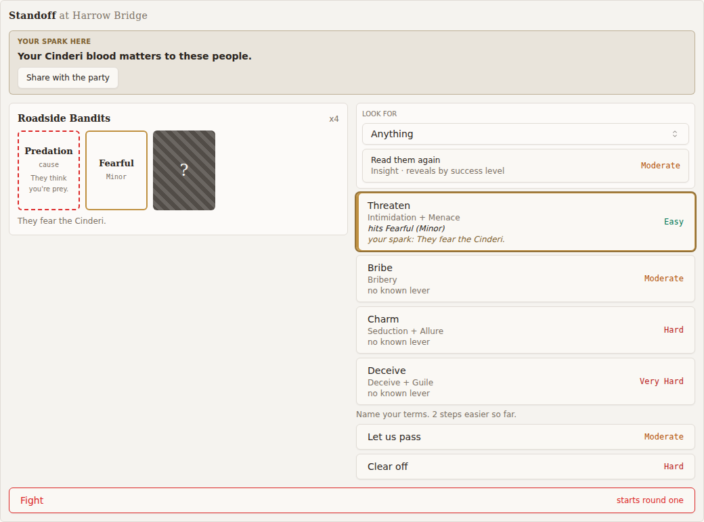 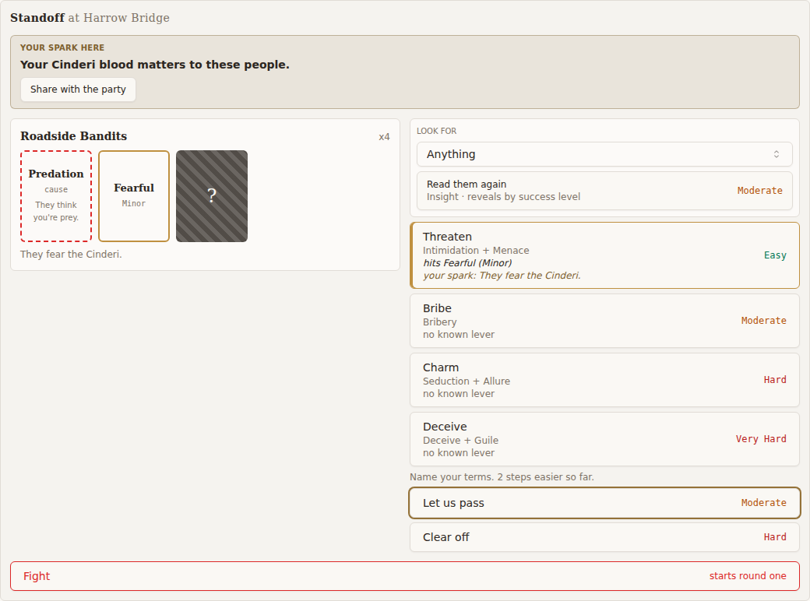 |

## Per-screen comparison detail

Compared by a vision-capable reviewer, rendered app against the demo, light theme, at the
demo's 1040px width and at the real 280px rail width. Demo annotation chrome ("Seen by...",
the "Exists/New" footers, the Mara note) is not product UI and is excluded.

### Screen 1: Arrival

| # | Demo element | Build | Status |
|---|---|---|---|
| 1.1 | Italic flavor line | On the mission BeatCard | RATIFIED (6) |
| 1.2 | "Your spark here" panel | Tinted panel, uppercase heading | MATCH. The tint is the realm primary (tan), not the demo's violet spark colour. Minor. |
| 1.3 | Bold spark text plus "How, you don't know yet. A read could tell you." | Present. At 280px it wraps cleanly above the Share button. | MATCH |
| 1.4 | Group panel "Roadside Bandits ×4" | Name plus `x4` | MATCH |
| 1.5 | Band caption, reaction line | Absent | RATIFIED (1) |
| 1.6 | Three hatched 92x118 face-down cards | Three hatched 92x118 cards with "?" and no sub-label | MATCH (labels RATIFIED (2)) |
| 1.7 | Two columns, group on the left and options on the right | Two columns at 1040px, stacked at 280px (container query) | MATCH |
| 1.8 | "Read them · Insight · reveals by success level · Moderate" | Same text and grade, under a "Look for" select | MATCH (the select is the spec's chosen-focus read) |
| 1.9 | Threaten / Bribe / Charm / Deceive with their check captions | Same captions | MATCH |
| 1.10 | Monospace grades, coloured (amber Moderate, red Hard) | Monospace, Moderate amber, Hard and Very Hard red | MATCH |
| 1.11 | "Name your terms · any time · Hard, no pressure yet" | Prose line plus one graded row per term | MATCH in substance |
| 1.12 | Fight row with danger outline and "starts round 1" | Danger-outlined row, "starts round one". It spans the full card width below both columns, not inside the options column. | MATCH (placement minor) |
| 1.13 | (none) | "no known lever" under every row at arrival. The demo shows it only once something is read (Screen 2). | Minor gap G1 |

### Screen 2: Read and press

| # | Demo element | Build | Status |
|---|---|---|---|
| 2.1 | "Aldric read them: strong success" | The reader gets a toast, "You read them. Success." Nothing persists on the card for the party. | Minor gap G2 |
| 2.2 | Cause card: red dashed, **Predation**, `cause`, gloss | Red dashed, **Predation**, `cause`, "They think you're prey." | MATCH |
| 2.3 | Drive card: accent border, **Fearful**, `Minor` | Same | MATCH |
| 2.4 | One remaining face-down card | One | MATCH |
| 2.5 | Terms ease `+1 +1` | "2 steps easier so far." | RATIFIED (3) |
| 2.6 | Hit row: accent border and inset bar, "hits Fearful · Menace counts twice", Easy | Accent border and inset bar, "hits Fearful (Minor)", Easy in green | MATCH. "Menace counts twice" is not stated. Minor gap G3. |
| 2.7 | Spark lever "they fear the Cinderi: your spark, now revealed to you" in the spark colour | "your spark: They fear the Cinderi." italic in primary | MATCH (colour minor) |
| 2.8 | "Bribe · no known lever · Moderate" | Same | MATCH |
| 2.9 | "Read them again · one drive still hidden" | "Read them again" with the caption "Insight · reveals by success level". The "one drive still hidden" count is not on this row; the face-down tile shows it. | MATCH |
| 2.10 | "Name your terms · two steps easier · Moderate" | Terms graded Moderate / Hard, "2 steps easier so far" | MATCH |
| 2.11 | Fight with morale | No morale | RATIFIED (5) |

### Screen 3: Terms

| # | Demo element | Build | Status |
|---|---|---|---|
| 3.1 | Prompt "Name your terms. Each successful press so far makes this roll easier..." | "Name your terms. Each successful press makes this easier." / "N steps easier so far." | MATCH (shortened) |
| 3.2 | Term cards, each with a name and an outcome description | Graded rows. The description appears only for the term you pick. | MATCH in substance. Showing every description up front is minor gap G5. |
| 3.3 | Term listed only once its drive is revealed | `required_drive` filter on the server (logic, not visual) | MATCH |
| 3.4 | "Spin for 'Let us pass'" primary plus "Keep pressing" outline | Same two buttons, same styling | MATCH |
| 3.5 | Spin dispatches terms; Keep pressing backs out | Verified by interaction | MATCH |

### Screen 5: Telnet

| # | Demo element | Build | Status |
|---|---|---|---|
| 5.1 | Header "Harrow Bridge. Roadside Bandits x4" | "Standoff at Harrow Bridge:" then "Roadside Bandits (4) - Open" | MATCH (band RATIFIED (1)) |
| 5.2 | "Cause: unknown. Drives: unknown x3" | "There is more to read here (4 unread)." | RATIFIED (2) |
| 5.3 | Spark line | "You feel: Your Cinderi blood matters to these people." | MATCH |
| 5.4 | Options line | Graded line per approach and term, then "You can: read, press, terms, fight, share." Grades are labels ("Impossible"). | MATCH |
| 5.5 | `read bandits` | `standoff read bandits` resolves the group | MATCH (subverb RATIFIED (8)) |
| 5.6 | Read result with the success level and the gloss | "You study them. <Level>." (`verbs.py:253`). The summary shows "Cause: Predation. They think you're prey." | MATCH |
| 5.7 | Press result "Easy. Success. Terms are now 2 steps easier." | "<Level>. They soften: Fearful. Terms are now 2 steps easier." (`verbs.py:455-464`, source) | MATCH |
| 5.8 | Terms result "They step aside. You cross unharmed." | "<Level>. <terms description>", falling back to "They accept." (`verbs.py:545-550`). Verified by test at HEAD, not in the rendered transcript. | MATCH |

### Combat panel during a standoff

| # | Expectation | Build | Status |
|---|---|---|---|
| P.1 | Round sections hidden before round 1 | All hidden | MATCH |
| P.2 | (demo has no panel header) | "Standoff" header above the card (`CombatTurnPanel.tsx:236-238`) | MATCH. It sits directly above the card's own "Standoff at Harrow Bridge" heading (N2, minor). |
| P.3 | Option rows hover and focus (the demo shows neither) | Muted hover with unchanged text; 2px focus ring | MATCH (legible; see N1) |

## Findings detail

### Defects

None.

### Second-pass findings: resolution

| Second pass | Now |
|---|---|
| H1 hover makes rows unreadable | Fixed (`hover:bg-muted hover:text-foreground focus-visible:ring-2` on the approach, Read, terms and Fight rows, `StandoffCard.tsx`). Verified by render and measured contrast. |
| G4 Read row label | Fixed ("Read them again" after a reveal) |
| G6 telnet terms text | Fixed (uses the terms description) |
| G7 "Your Turn: Round 0" header | Fixed ("Standoff") |

### Minor gaps

Listed under "Accepted minor gaps (non-blocking)" at the top of this report.

### First-pass findings: resolution

| First pass | Now |
|---|---|
| D1 raw enum grades | Fixed (`grade_label`) |
| D2 spark row collapse at 280 | Fixed (stacked) |
| D3 Look-for select overflow | Fixed (truncating trigger) |
| D4 check captions missing | Fixed (`check_caption`) |
| D5 hit row not marked; spark lever untied | Fixed |
| D7 spark hint and "no known lever" | Fixed |
| D8 small face-down tiles | Fixed (92x118 hatched) |
| D9 Fight styling and caption | Fixed |
| D10 result messages without success level | Fixed (terms since `89baa1804`) |
| D11 telnet place header | Fixed |
| S1 terms one-click | Fixed (confirm step with description) |
| S2, S6, S7 | Ratified |
| S3 two columns | Fixed (container query) |
| S4 panel sections during a standoff | Fixed and verified by render |
| S5 Read grade and caption | Fixed |
| S8 telnet short names | Fixed |

## Mandatory criteria

| Criterion | Verdict |
|---|---|
| Demo reached and read | PASS. Local copy; identity with the artifact is the implementer's statement. |
| Diff read | PASS (`e2410d63f`, `731abc107`, `89baa1804`, plus the first-pass diff) |
| Surface rendered, not reviewed by eye | PASS. Real component and panel in Chromium, plus live telnet code. |
| Screenshots committed in the report directory | PASS once committed. 27 images plus one text file are in `docs/reviews/4145/`, and every one is cited above. All app images except the telnet transcript were re-rendered at HEAD. They are uncommitted at the time of writing; the controller commits them with this report. |
| Rules reach the page | PASS. Tailwind utilities are compiled from `src/**`; `standoff.css` is imported by the component. The hatch, tile size and container-query columns all render, as seen in the screenshots. |
| Host CSS contract | PASS (realm tokens, shared `Button` and `Select`) |
| Screen 1 | PASS with minor gap (G1) |
| Screen 2 | PASS with minor gaps (G2, G3) |
| Screen 3 | PASS with minor gap (G5) |
| Screen 5 (telnet) | PASS |
| Panel during a standoff | PASS (N2 minor) |
| Hover and focus legibility | PASS (H1 fixed; N1 minor, from the shared token) |
| Screen 4 | Not applicable (out of scope) |

## Per-screen verdict

- **Screen 1, Arrival:** matches with a noted gap (G1).
- **Screen 2, Read and press:** matches with noted gaps (G2, G3).
- **Screen 3, Terms:** matches with a noted gap (G5).
- **Screen 5, Telnet:** matches.

## Proposed mechanical check

A Playwright check at 280px: hover each `standoff-card` button, then assert that every
descendant text node has a WCAG contrast of at least 4.5:1 against the button's computed
background. This would have caught H1, and catches any later row content that ignores the hover colour. Set the threshold at 3:1 for the muted caption until the shared token is fixed (N1). The
first-pass proposal (no grade text matching `/^[a-z_]+$/`) is now covered by the vitest at
`StandoffCard.test.tsx:168`.
