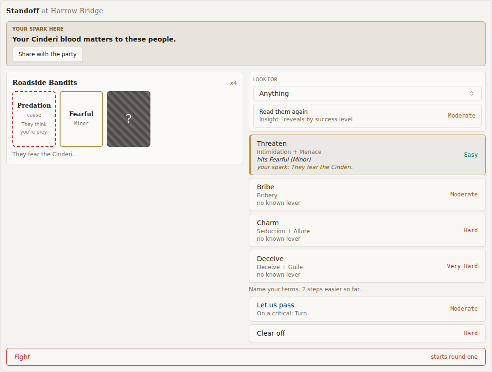
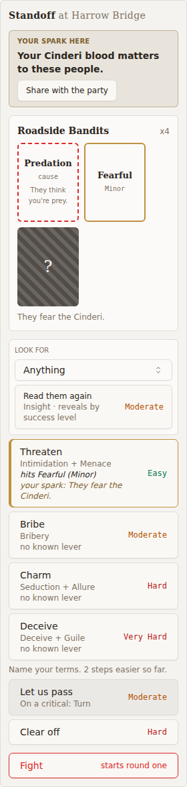
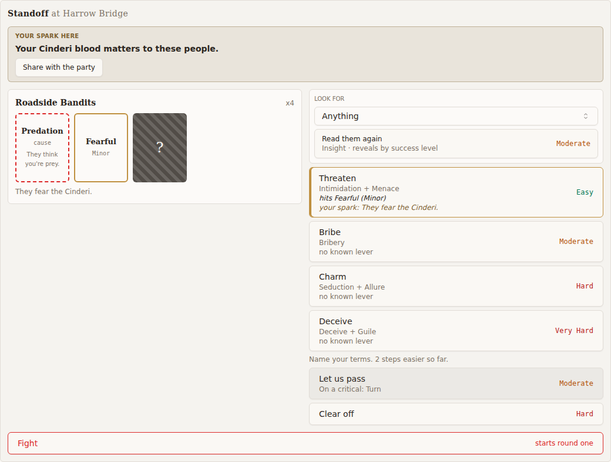
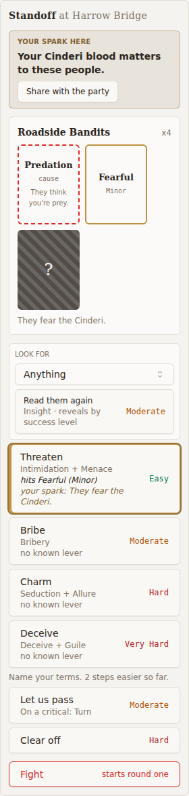
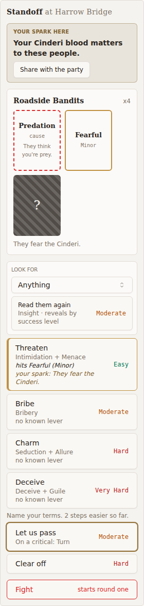
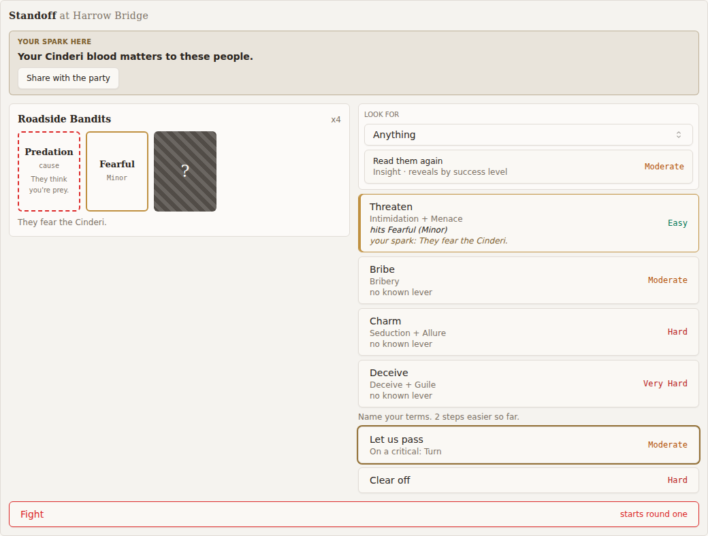

# Review evidence

- Reviewed revision: `1191099a679fe8c590dfb8cd13e30a57bb0fbf64`
- Reviewer: demo-fidelity-reviewer agent (fourth pass)
- Reviewer verdict: PASS
- Application/build identity: Vite 6.4.3 dev server (throwaway scratchpad harness, nothing added to the repo) serving the real StandoffCard and CombatTurnPanel from the worktree frontend/src at 1191099a6, compiled with the worktree Tailwind and PostCSS config (server cwd frontend/) and src/index.css; telnet summary and room lines from live CmdStandoff, build_standoff_view and the standoff actions via scratch tests on factory rows at 1191099a6
- Environment: Linux devcontainer, headless Chromium via the worktree @playwright/test, html data-realm default without the dark class, Google Fonts unreachable so demo and app share the same local serif fallback; telnet through the SQLite fast tier (just test-fast)
- Viewports/themes: 1280x1000 viewport, light colour scheme, card rendered at 280px (play sidebar rail) and 1040px (demo column); demo forced to data-theme light
- Approved design: https://claude.ai/artifact/PHUgGBC2Cus5no5FEdhQqE, reviewed from the local copy .superpowers/sdd/2026-10-04-standoffs-slice1/demo.html (identity with the artifact is the implementer's statement); Screens 1, 2, 3 and 5 in scope, Screen 4 out of scope
- Visual review: Completed
- Visual verdict: PASS
- Screenshots:                     
- Comparison notes: Rendered app re-captured at 1191099a6 and compared with demo Screens 1, 2, 3 and 5 at 280px and 1040px light. Changes since the third pass checked on the render: levers are objects styled by is_spark (spark lever in primary, drive lever in foreground, measured), terms rows carry a muted "On a critical: Turn" line, telnet shows "(on a critical: Turn)" and lever text, and a press now sends an authored reaction line, a morale-shift line and an attack line to the room in that order. No blocking mismatch; non-blocking gaps G1, G2, G3, G5, G8, N1, N2, N3 below
- Tested interactions: hover and keyboard focus on the hit approach row and on a terms row that carries a critical label, at both widths; Let us pass opening the confirm panel; Spin dispatching standoff_terms with group 11, terms 31; Keep pressing closing the confirm without a dispatch; Threaten dispatching standoff_press with group 11, approach 1; overflow probe at both widths in both states; combat panel during a standoff at both widths; telnet standoff summary before and after a read; a critical, morale-damaging press that trips Predation, through dispatch_player_action
- Fixture/live boundary: web card and combat panel rendered from hand-built StandoffView and EncounterDetail fixtures in the generated API shape (levers as text plus is_spark, terms critical_label), all API calls intercepted by Playwright; telnet summary from live CmdStandoff and build_standoff_view on factory rows; room lines from the live StandoffPressAction through dispatch_player_action with a forced critical check outcome and broadcast_action_outcome patched to capture narration
- Overall outcome: PASS

Summary: **Verdict: PASS.** Everything changed since the third pass (`89baa1804`) renders correctly and stays inside the demo's visual grammar. Spark levers keep the primary colour by flag rather than by string prefix. The critical-upgrade line uses the card's own muted caption style. The new room lines follow the demo's telnet press shape and read press, then morale, then attack. No new defects. The remaining gaps are minor and already known, plus three notes (G8 and N3 new, N1 now also covering the critical line).

## Visual checklist

Compared by a vision-capable reviewer, rendered app against the demo, light theme, at 280px
and 1040px. Demo annotation chrome is excluded. Ratified departures and accepted minor gaps
are listed in their own sections, not here.

| Element | Expected | Result | Evidence |
|---|---|---|---|
| Screen 1: spark panel | Tinted 'Your spark here' panel, bold spark text, 'How, you don't know yet. A read could tell you.', share control | MATCH | [app-screen1-arrival-rail280.png](docs/reviews/4145/app-screen1-arrival-rail280.png), [app-screen1-arrival-wide1040.png](docs/reviews/4145/app-screen1-arrival-wide1040.png), [demo-screen1-arrival.png](docs/reviews/4145/demo-screen1-arrival.png) |
| Screen 1: group header | 'Roadside Bandits' with a x4 count | MATCH | [app-screen1-arrival-rail280.png](docs/reviews/4145/app-screen1-arrival-rail280.png), [app-screen1-arrival-wide1040.png](docs/reviews/4145/app-screen1-arrival-wide1040.png) |
| Screen 1: face-down cards | Three hatched 92x118 face-down cards | MATCH | [app-screen1-arrival-rail280.png](docs/reviews/4145/app-screen1-arrival-rail280.png), [app-screen1-arrival-wide1040.png](docs/reviews/4145/app-screen1-arrival-wide1040.png) |
| Screen 1: layout | Group on the left, options on the right at 1040px; stacked at the 280px rail | MATCH | [app-screen1-arrival-rail280.png](docs/reviews/4145/app-screen1-arrival-rail280.png), [app-screen1-arrival-wide1040.png](docs/reviews/4145/app-screen1-arrival-wide1040.png) |
| Screen 1: Read row | 'Read them', Insight caption, 'reveals by success level', Moderate grade | MATCH | [app-screen1-arrival-rail280.png](docs/reviews/4145/app-screen1-arrival-rail280.png), [app-screen1-arrival-wide1040.png](docs/reviews/4145/app-screen1-arrival-wide1040.png) |
| Screen 1: approach rows | Threaten, Bribe, Charm, Deceive with check captions | MATCH | [app-screen1-arrival-rail280.png](docs/reviews/4145/app-screen1-arrival-rail280.png), [app-screen1-arrival-wide1040.png](docs/reviews/4145/app-screen1-arrival-wide1040.png) |
| Screen 1: grades | Monospace grade labels, amber Moderate, red Hard | MATCH | [app-screen1-arrival-rail280.png](docs/reviews/4145/app-screen1-arrival-rail280.png), [app-screen1-arrival-wide1040.png](docs/reviews/4145/app-screen1-arrival-wide1040.png) |
| Screen 1: terms entry | 'Name your terms' with graded terms | MATCH | [app-screen1-arrival-rail280.png](docs/reviews/4145/app-screen1-arrival-rail280.png), [app-screen1-arrival-wide1040.png](docs/reviews/4145/app-screen1-arrival-wide1040.png) |
| Screen 1: terms row critical upgrade | Secondary line under the term name in the card's caption style, not competing with the grade | MATCH | [app-screen1-arrival-rail280.png](docs/reviews/4145/app-screen1-arrival-rail280.png), [app-screen1-arrival-wide1040.png](docs/reviews/4145/app-screen1-arrival-wide1040.png) |
| Screen 1: Fight row | Danger-outlined Fight row, 'starts round one' | MATCH | [app-screen1-arrival-rail280.png](docs/reviews/4145/app-screen1-arrival-rail280.png), [app-screen1-arrival-wide1040.png](docs/reviews/4145/app-screen1-arrival-wide1040.png) |
| Screen 2: cause card | Red dashed card, Predation, 'cause', gloss | MATCH | [app-screen2-pressed-rail280.png](docs/reviews/4145/app-screen2-pressed-rail280.png), [app-screen2-pressed-wide1040.png](docs/reviews/4145/app-screen2-pressed-wide1040.png), [demo-screen2-read-press.png](docs/reviews/4145/demo-screen2-read-press.png) |
| Screen 2: drive card | Accent-bordered card, Fearful, Minor | MATCH | [app-screen2-pressed-rail280.png](docs/reviews/4145/app-screen2-pressed-rail280.png), [app-screen2-pressed-wide1040.png](docs/reviews/4145/app-screen2-pressed-wide1040.png) |
| Screen 2: remaining face-down card | One face-down card left | MATCH | [app-screen2-pressed-rail280.png](docs/reviews/4145/app-screen2-pressed-rail280.png), [app-screen2-pressed-wide1040.png](docs/reviews/4145/app-screen2-pressed-wide1040.png) |
| Screen 2: hit row | Accent border and inset bar, 'hits Fearful', Easy | MATCH | [app-screen2-pressed-rail280.png](docs/reviews/4145/app-screen2-pressed-rail280.png), [app-screen2-pressed-wide1040.png](docs/reviews/4145/app-screen2-pressed-wide1040.png) |
| Screen 2: spark lever | Italic spark lever on the hit row in the spark colour, distinct from the drive lever | MATCH | [app-screen2-pressed-rail280.png](docs/reviews/4145/app-screen2-pressed-rail280.png), [app-screen2-pressed-wide1040.png](docs/reviews/4145/app-screen2-pressed-wide1040.png) |
| Screen 2: Bribe row | 'Bribe', 'no known lever', Moderate | MATCH | [app-screen2-pressed-rail280.png](docs/reviews/4145/app-screen2-pressed-rail280.png), [app-screen2-pressed-wide1040.png](docs/reviews/4145/app-screen2-pressed-wide1040.png) |
| Screen 2: Read them again | Read row relabelled 'Read them again' after a reveal | MATCH | [app-screen2-pressed-rail280.png](docs/reviews/4145/app-screen2-pressed-rail280.png), [app-screen2-pressed-wide1040.png](docs/reviews/4145/app-screen2-pressed-wide1040.png) |
| Screen 2: terms eased | Terms graded easier after presses | MATCH | [app-screen2-pressed-rail280.png](docs/reviews/4145/app-screen2-pressed-rail280.png), [app-screen2-pressed-wide1040.png](docs/reviews/4145/app-screen2-pressed-wide1040.png) |
| Screen 3: terms prompt | 'Name your terms', presses make this easier | MATCH | [app-screen3-terms-confirm-rail280.png](docs/reviews/4145/app-screen3-terms-confirm-rail280.png), [app-screen3-terms-confirm-wide1040.png](docs/reviews/4145/app-screen3-terms-confirm-wide1040.png), [demo-screen3-terms.png](docs/reviews/4145/demo-screen3-terms.png) |
| Screen 3: chosen term description | Outcome description 'They step aside. You cross unharmed.' | MATCH | [app-screen3-terms-confirm-rail280.png](docs/reviews/4145/app-screen3-terms-confirm-rail280.png), [app-screen3-terms-confirm-wide1040.png](docs/reviews/4145/app-screen3-terms-confirm-wide1040.png) |
| Screen 3: confirm buttons | Primary 'Spin for "Let us pass"' and outline 'Keep pressing' | MATCH | [app-screen3-terms-confirm-rail280.png](docs/reviews/4145/app-screen3-terms-confirm-rail280.png), [app-screen3-terms-confirm-wide1040.png](docs/reviews/4145/app-screen3-terms-confirm-wide1040.png) |
| Screen 5: telnet header | Place and group header | MATCH | [app-screen5-telnet.png](docs/reviews/4145/app-screen5-telnet.png), [demo-screen5-telnet.png](docs/reviews/4145/demo-screen5-telnet.png) |
| Screen 5: telnet spark and options | Spark line and graded options line, levers and critical upgrade in text | MATCH | [app-screen5-telnet.png](docs/reviews/4145/app-screen5-telnet.png) |
| Screen 5: press result line | Reaction prose with the actor named, then the level and the terms ease | MATCH | [app-screen5-telnet.png](docs/reviews/4145/app-screen5-telnet.png), [demo-screen5-telnet.png](docs/reviews/4145/demo-screen5-telnet.png) |
| Panel during a standoff | Only the standoff shown, round sections hidden, header 'Standoff' | MATCH | [app-panel-standoff-rail280.png](docs/reviews/4145/app-panel-standoff-rail280.png), [app-panel-standoff-wide1040.png](docs/reviews/4145/app-panel-standoff-wide1040.png) |
| Option row hover | Row stays legible on hover; text keeps its colours | MATCH | [app-hover-approach-hit-threaten-rail280.png](docs/reviews/4145/app-hover-approach-hit-threaten-rail280.png), [app-hover-approach-hit-threaten-wide1040.png](docs/reviews/4145/app-hover-approach-hit-threaten-wide1040.png), [app-hover-terms-critical-rail280.png](docs/reviews/4145/app-hover-terms-critical-rail280.png), [app-hover-terms-critical-wide1040.png](docs/reviews/4145/app-hover-terms-critical-wide1040.png) |
| Option row keyboard focus | Visible focus ring on the approach and terms rows | MATCH | [app-focus-approach-hit-threaten-rail280.png](docs/reviews/4145/app-focus-approach-hit-threaten-rail280.png), [app-focus-approach-hit-threaten-wide1040.png](docs/reviews/4145/app-focus-approach-hit-threaten-wide1040.png), [app-focus-terms-critical-rail280.png](docs/reviews/4145/app-focus-terms-critical-rail280.png), [app-focus-terms-critical-wide1040.png](docs/reviews/4145/app-focus-terms-critical-wide1040.png) |

## Ratified decisions

1. The arrival reaction line and the level-band caption ("an even match") are not on the card.
   The arrival line has no data source, and the band has to be earned by a check. Since
   `2ba70868d`, staff-authored press and terms reactions exist, and they go to the room
   (narration feed and telnet), not onto the card. See G8.
2. The cause and drives start hidden. Face-down tiles carry no `cause` / `drive` label.
3. Terms ease is shown as a count ("2 steps easier so far"), not as pips.
4. Owner-only options live on the mission BeatCard as "because" reasons. BeatCard is
   unchanged since the first pass and was not re-rendered.
5. Players see no morale on the Fight row; morale stays GM-only. The new room line "X shakes
   the Y: they falter/break" names a state change only, never a number, which is the same
   information as the demo's "their morale is dented".
6. The mission flavor line stays on the mission BeatCard.
7. The cause gloss is placeholder text, one per cause kind.
8. Telnet uses `standoff <subverb>`, per spec section 10.

## Accepted minor gaps (non-blocking)

- **G1.** "no known lever" shows on every row at arrival. The demo shows it only after a read.
- **G2.** The card has no persistent "X read them: level" line for the party. The reader gets a toast.
- **G3.** The hit row does not say how strongly the modifier counts ("Menace counts twice").
- **G5.** Term descriptions show only after a term is picked, not on every term up front.
- **G8.** The demo draws the press reaction ("Vess steps forward...") inside the card. The build sends the authored reaction to the room as a narration line, which the whole party sees, the audience the demo names. This is a placement difference, not missing copy. The human may want to rule on it; it does not block.
- **N1.** The shared muted caption token measures 4.37:1 at rest and 3.82:1 on the hover fill, under 4.5:1 for small text. The new "On a critical" line uses the same token, so the same numbers apply. The token is app-wide and this branch did not introduce it. Text stays readable in the screenshots.
- **N2.** In the combat panel the header "Standoff" sits directly above the card's own "Standoff at Harrow Bridge". Redundant, harmless.
- **N3.** The critical line shows the effect's display label, so it reads "On a critical: Turn". That is terse next to the demo's prose ("Turns them; harder"), but it reads correctly, and the label belongs to the TermsEffect choices, not the card.

## Requirement ledger

| ID | Status | Evidence | Authorized decision |
|---|---|---|---|
| S1-arrival | PASS | Screen 1 Arrival matches the demo, critical line included: [app-screen1-arrival-rail280.png](docs/reviews/4145/app-screen1-arrival-rail280.png), [app-screen1-arrival-wide1040.png](docs/reviews/4145/app-screen1-arrival-wide1040.png) |  |
| S2-read-press | PASS | Screen 2 Read and press matches; spark lever computed colour rgb(126,97,48) (text-primary), drive lever rgb(44,38,33) (text-foreground): [app-screen2-pressed-rail280.png](docs/reviews/4145/app-screen2-pressed-rail280.png), [app-screen2-pressed-wide1040.png](docs/reviews/4145/app-screen2-pressed-wide1040.png) |  |
| S3-terms | PASS | Confirm step dispatches standoff_terms group 11 terms 31; Keep pressing backs out with no dispatch: [app-screen3-terms-confirm-rail280.png](docs/reviews/4145/app-screen3-terms-confirm-rail280.png), [app-screen3-terms-confirm-wide1040.png](docs/reviews/4145/app-screen3-terms-confirm-wide1040.png) |  |
| S5-telnet | PASS | Live summary with levers and critical upgrade; room lines press, morale, attack in order: [app-screen5-telnet.png](docs/reviews/4145/app-screen5-telnet.png) |  |
| S4-gm-rail | OUT_OF_SCOPE | Out of scope for slice 1 per the spec | Spec non-goals: GM-run stories and the GM rail are a later slice of #4121 |
| P-panel | PASS | Combat panel shows only the standoff; the only testid outside the card is combat-turn-panel: [app-panel-standoff-rail280.png](docs/reviews/4145/app-panel-standoff-rail280.png), [app-panel-standoff-wide1040.png](docs/reviews/4145/app-panel-standoff-wide1040.png) |  |
| H1-hover | PASS | Rows legible on hover and focus at 280 and 1040, measured contrast below: [app-hover-terms-critical-rail280.png](docs/reviews/4145/app-hover-terms-critical-rail280.png), [app-focus-approach-hit-threaten-wide1040.png](docs/reviews/4145/app-focus-approach-hit-threaten-wide1040.png) |  |
| CSS-reach | PASS | Tailwind utilities and the imported standoff.css render (hatch, tile size, container-query columns): [app-screen1-arrival-wide1040.png](docs/reviews/4145/app-screen1-arrival-wide1040.png), [app-screen2-pressed-rail280.png](docs/reviews/4145/app-screen2-pressed-rail280.png) |  |
| Host-contract | PASS | Realm tokens and the shared Button and Select; the new critical line uses text-muted-foreground: [app-screen2-pressed-wide1040.png](docs/reviews/4145/app-screen2-pressed-wide1040.png) |  |
| Overflow | PASS | No element inside the card has scrollWidth beyond clientWidth at 280 or 1040, arrival or pressed: [app-screen2-pressed-rail280.png](docs/reviews/4145/app-screen2-pressed-rail280.png) |  |
| Demo-read | PASS | Approved demo reached and read (local copy of the artifact): [demo-screen2-read-press.png](docs/reviews/4145/demo-screen2-read-press.png) |  |

## Unresolved findings

- None

## Detailed report

### What changed since the third pass (89baa1804 to 1191099a6)

Frontend: `StandoffCard.tsx` keys and styles levers by `lever.is_spark` (was
`startsWith('your spark')`), and the terms row adds `On a critical: {critical_label}` as a
`block text-xs text-muted-foreground` line under the name. `api.d.ts` gains `LeverView` and
`critical_label`. Server: `LeverView` in `view.py`, `critical_label` from
`get_critical_effect_display()`; `reactions.py` (authored, banded reaction lines);
`_morale_shift_line` and attack lines in `verbs.py`/`state.py`; `_announce` in
`actions/definitions/standoff.py` sends press or reaction, then morale, then attack; the
telnet summary adds lever text and `(on a critical: ...)`.

### Fixture versus live

- **Web card and panel: fixture.** Hand-built `StandoffView` in the generated shape. Arrival:
  one group of 4, `hidden_count` 3, the viewer's spark, 4 approaches, terms "Let us pass"
  (`critical_label` "Turn") and "Clear off" (`critical_label` ""). Pressed: cause and Fearful
  revealed, the regard line revealed, `terms_ease` 2, and Threaten as the hit row with levers
  `{hits Fearful (Minor), is_spark false}` and `{your spark: They fear the Cinderi., is_spark true}`.
  The panel was served `/api/combat/1/` with `round_number` 0.
- **Telnet summary: live** `CmdStandoff` on factory rows (scratch subclass of
  `CmdStandoffTests`), with a real Application linking Threaten's capability to Fearful and a
  revealed regard rule. Grades read "Impossible" because the factory character has no stats.
- **Room lines: live** `StandoffPressAction` through `dispatch_player_action` (scratch
  subclass of `StandoffJourneyBase`), with a forced critical, an authored reaction line
  ("[actor] bares her teeth. Two of the [group] take a step back."), a morale-damaging
  approach and a Predation margin that trips the attack. Narration was captured from
  `broadcast_action_outcome`. Factory names ("Creature 0", "TestChar_2") are the factories'
  own names. Transcript: [app-screen5-telnet.txt](4145/app-screen5-telnet.txt).

### Interactions and measurements

| Action | Result |
|---|---|
| Hover Threaten (hit row), 280 and 1040 | Fill rgb(235,233,229). Title 12.32:1, caption 3.82:1 (N1), drive lever 12.32:1, spark lever 4.76:1, Easy 4.52:1 |
| Focus Threaten, 280 and 1040 | `:focus-visible` true, 2px ring. Title 14.08:1, caption 4.37:1, spark lever 5.44:1, Easy 5.17:1 |
| Hover Let us pass (critical row), 280 and 1040 | Title 12.32:1, "On a critical: Turn" 3.82:1 (N1), Moderate 4.14:1 |
| Focus Let us pass, 280 and 1040 | `:focus-visible` true. Title 14.08:1, critical line 4.37:1, Moderate 4.73:1 |
| Click Let us pass, then Spin | Confirm shows "They step aside. You cross unharmed."; Spin sends `standoff_terms` `{"group_id":11,"terms_id":31}` |
| Let us pass, then Keep pressing | Confirm closes (0 panels), nothing sent |
| Click Threaten | `standoff_press` `{"group_id":11,"approach_id":1}` |
| Overflow probe | Empty at both widths in both states |
| Panel during a standoff | h2 "Standoff"; no round sections rendered |

### Screen 5: telnet, line by line

| Demo | Build | Status |
|---|---|---|
| "Harrow Bridge. Roadside Bandits x4 (an even match)." | "Standoff at Harrow Bridge:" / "Roadside Bandits (4) - Open" | MATCH (band RATIFIED 1) |
| "Cause: unknown. Drives: unknown x3" | "There is more to read here (4 unread)." | RATIFIED 2 |
| "Your spark: ..." | "You feel: Your Cinderi blood matters to these people." | MATCH |
| Options line | One graded line per approach and term, "press Threaten: ... (hits Fearful (Minor); your spark: They fear the Cinderi.)", "terms Let us pass: ... (on a critical: Turn)" | MATCH |
| "Vess bares her teeth. Easy. Success. Terms are now 2 steps easier." | Actor: "Critical success. They soften. Terms are now 1 step easier. They attack!" Room: "[persona] bares her teeth. Two of the [group] take a step back." then "[persona] shakes the [group]: they break." then "The [group] attack!" | MATCH. The reaction prose and the level arrive as two lines, not one. |
| "They step aside. You cross unharmed." | "Level. [terms description]" (verified in the third pass, unchanged) | MATCH |

## Screenshots

| Screen | Demo (approved) | Build |
|---|---|---|
| 1 Arrival |  |   |
| 2 Read and press |  |   |
| 3 Terms |  |   |
| 5 Telnet |  |  |
| Panel in a standoff | n/a |   |
| Hover (the demo has no hover state) | n/a |     |
| Focus (the demo has no focus state) | n/a |     |

## Mandatory criteria

| Criterion | Verdict |
|---|---|
| Demo reached and read | PASS. Local copy; identity with the artifact is the implementer's statement. |
| Diff read | PASS (`89baa1804..1191099a6`, frontend in full, server verbs, view, actions, command) |
| Surface rendered, not reviewed by eye | PASS. Real component and panel in Chromium; live telnet and action code |
| Screenshots in the report directory | PASS. 21 images plus one transcript in `docs/reviews/4145/`, all rendered at 1191099a6 (the demo ones from the demo file) |
| Rules reach the page | PASS. Every class used by the new code (`block`, `text-xs`, `text-muted-foreground`, `text-primary`, `text-foreground`) is a compiled Tailwind utility, and its computed colour was measured on the page |
| Host CSS contract | PASS |
| Screen 1 | PASS with minor gap (G1) |
| Screen 2 | PASS with minor gaps (G2, G3, G8) |
| Screen 3 | PASS with minor gap (G5) |
| Screen 5 (telnet) | PASS |
| Panel during a standoff | PASS (N2 minor) |
| Hover and focus legibility | PASS (N1 minor, shared token) |
| Screen 4 | Not applicable (out of scope) |

## Per-screen verdict

- **Screen 1, Arrival:** matches with a noted gap (G1).
- **Screen 2, Read and press:** matches with noted gaps (G2, G3, G8).
- **Screen 3, Terms:** matches with a noted gap (G5).
- **Screen 5, Telnet:** matches.

## Proposed mechanical check

The lever styling already has a vitest (`StandoffCard.test.tsx`, which asserts `text-primary` on
the spark lever and `text-foreground` on the drive lever). The third pass's proposal still
stands: a Playwright hover-contrast check over every `standoff-card` button at 280px, with a
4.5:1 threshold, or 3:1 for muted captions until N1 is fixed.
