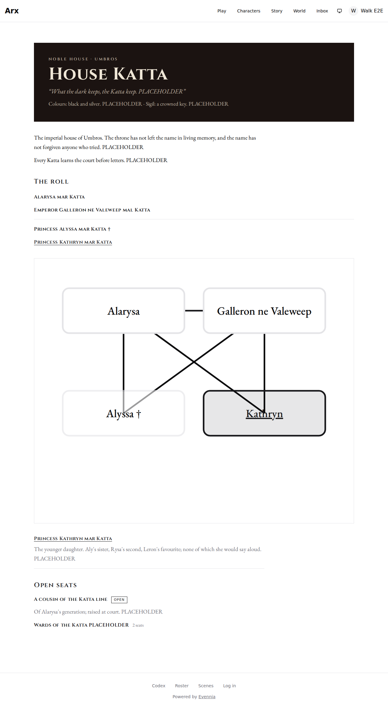
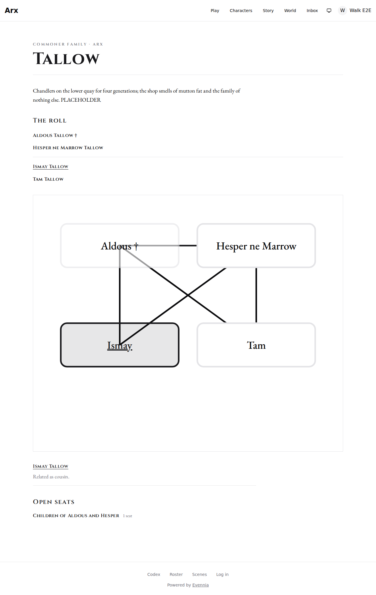
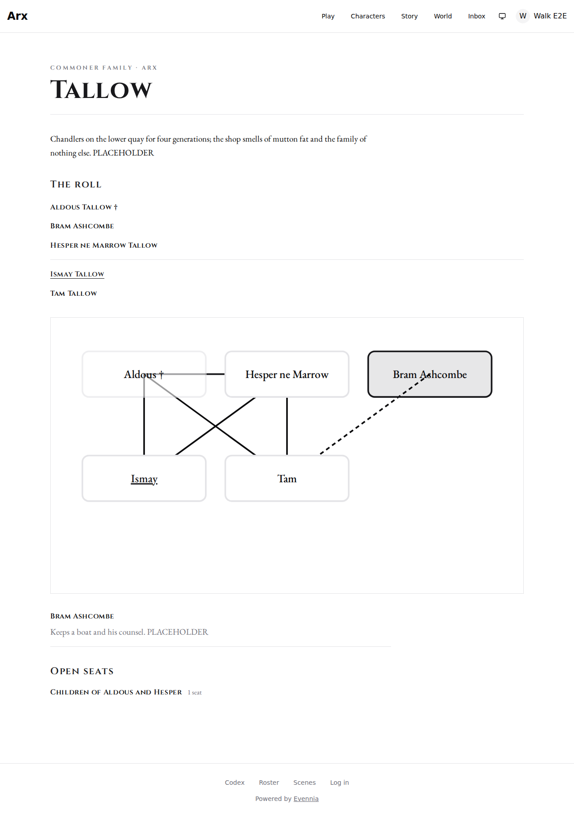
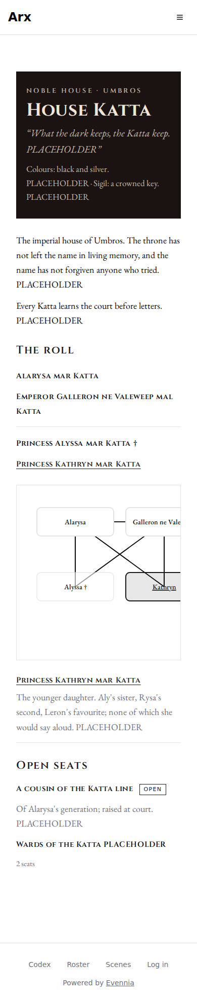

# Review evidence

- Reviewed revision: `e1e6481a1fe3c2555f3dd89a7a17427966dcfec4`
- Reviewer: the implementing agent (Claude Code), running the demo-fidelity review inline against the four boards of the approved design, with Playwright on the real `/families/:id` page from the production bundle, every `/api/**` call answered by fixtures shaped like the serializers; no migration
- Reviewer verdict: PASS
- Application/build identity: `vite build` of the frontend at the reviewed revision, served by `vite preview --port 4183`; harness `frontend/e2e/evidence/family-page-4209.spec.ts`, four readings, all passing (10.6 s)
- Environment: Linux devcontainer on WSL2, Playwright Chromium headless (build 1208)
- Viewports/themes: 1280x900 and 390x1100, the default light theme
- Approved design: the demo canvas linked from the issue's spec (https://claude.ai/artifact/CM5zpx44de1bSQzMS5v3r8, version 27, four boards: "House Katta, as a stranger reads it"; "Tallow, a commoner family with no house, as a stranger reads it"; "Tallow, for a viewer who knows the secret"; "Phone"), with ApostateCD's rulings of 2026-10-09 in the issue's Decisions: no definition-tier words on any player kin surface; full-formal names on the roll and the selected entry, the tree form in the tree; no "married in" or "connected" tags; the dagger stays; the selected entry prints the relatedness line only when a label exists
- Visual review: Completed
- Visual verdict: PASS
- Screenshots:     
- Comparison notes: Board by board, in the demo's order. **House Katta.** The gate is the demo's plate, painted in the same night literals (ground #1b1311, soft #c4b8a6), with the eyebrow, title, words and arms in the same places and voices (Cinzel caps, Garamond body). The description runs in two paragraphs as drawn. The roll prints the four full-formal names in two generation lists with a rule between them, the dagger on Alyssa, and Kathryn as the only link; nothing prints a tier word. The tree prints the short forms ("Galleron ne Valeweep", "Alyssa †" at reduced opacity, "Kathryn" underlined and linking to her sheet). The selected entry carries her full name as a link and her blurb, and prints no filler line (the version-27 board). The open seats show the appable seat with its chip and blurb and the pool with its count. Two differences, neither a defect: the tree's edges are the existing `KinTreeGraph`'s own drawing (direct parent-to-child lines and a spouse connector, ADR-0097's N-parent layout) where the board sketched a bar-and-drop genealogy; the spec names the component, so the graph's drawing is the approved one. And the ink: the board used the Folio literal red (#8b3423) for headings and links, the build uses the app's `--primary` token, as the realm pages and the sheet do (sheet.css: colour comes from the app's realm tokens so light/dark and plain mode keep working), which reads near-black in the default theme. **Tallow.** The plain head with the kind-and-realm eyebrow and the bare name, no "House", no words or arms. "Hesper ne Marrow Tallow" on the roll and "Hesper ne Marrow" in the tree, as the version-27 board prints them. Ismay, played, links in the roll and the tree, and her selected entry prints "Related as cousin." for the viewer's own character. The pool reads "Children of Aldous and Hesper · 1 seat". **Tallow, knowing the secret.** Bram Ashcombe appears on the roll and in the tree, with no tag, his edge to Tam dashed. The board drew his box dashed as well; the build marks the edge only, which is the graph's standing convention (a secret-known fact is an edge, and the dashing is the edge's). The board printed "Related as aunt/uncle." under Bram; the build prints no line, and cannot: relatedness runs between two sheets (`KinRelationshipView` takes sheet pks) and Bram, unlinked on the board, has none. The line is proved on the played Ismay in the previous reading. **Phone.** Everything stacks in one column with the 16px gutters; the tree scrolls sideways inside its frame and the document has no horizontal overflow (asserted).
- Tested interactions: open `/families/7` signed in as a non-member with a selected character; read the plate, the description, the roll's names and links, the tree's names and link, the open seats; click Kathryn's box away from her name and read the selected entry. Open `/families/8` (a commoner family); read the head, the roll and the tree; click Ismay's box and read the relatedness line; read the pool count. Open the same with the secret-knower payload; count the dashed edges (one); click Bram's box and read his entry. Open `/families/7` at 390 wide; click Kathryn's box; read her entry; measure the overflow. No page errors were raised on any reading.
- Fixture/live boundary: the route, `ProtectedRoute`, `FamilyPage`, its hooks, `KinTreeGraph`, the stylesheet and the bundle are real; every `/api/**` response is a fixture (the account with a `selected_entry` whose `character_id` is the viewer's sheet, the two family trees with `house`, `realm_name` and per-node `full_name`/`short_name`, the slots payloads, and `{label}` for the relationship query). That the real endpoint produces those keys and names, reaches a non-playable family, widens the roll under the viewer's gate and keeps a fixed query count is proved over HTTP by `world.roster.tests.test_kin_api.FamilyTreeViewTests` (8 tests) on both tiers, and the naming grammar by `world.societies.tests.test_houses.TreeNamesTests` (3); the page's own readings are also proved by `FamilyPage.test.tsx` (8), `KinshipPanel.test.tsx` (11), `SheetPanel.test.tsx` (2), `OrgPage.test.tsx` and `RealmPage.test.tsx` (the link assertions).
- Overall outcome: PASS

## Visual checklist

| Element | Expected | Result | Evidence |
|---|---|---|---|
| Gate plate for a house-styled family | night plate; eyebrow "Noble House · Umbros"; "House Katta"; words in italic; "Colours: … · Sigil: …" | MATCH | 01-house-katta-1280.png |
| Family description | the family's own text, paragraphs | MATCH | 01-house-katta-1280.png |
| The roll | one list per generation, a rule between; full-formal names; dagger on the deceased; the played person linked to `/characters/2`; no tier words | MATCH | 01-house-katta-1280.png |
| The tree | short forms ("Galleron ne Valeweep"); the deceased at reduced opacity with the dagger; the played person's name a link | MATCH (edge drawing is the graph's own, see notes) | 01-house-katta-1280.png |
| Selected entry | full-formal name as a link, the blurb, no filler line | MATCH | 02-house-katta-selected-1280.png |
| Open seats | seat name with an "open" chip and its blurb; pool with "2 seats" | MATCH | 01-house-katta-1280.png |
| Plain head for a commoner family | "Commoner Family · Arx"; bare "Tallow"; no words or arms | MATCH | 03-tallow-1280.png |
| Taken-in commoner's names | "Hesper ne Marrow Tallow" on the roll, "Hesper ne Marrow" in the tree | MATCH | 03-tallow-1280.png |
| Relatedness line | "Related as cousin." under a played, related person | MATCH | 03-tallow-1280.png |
| Secret relative for a knower | on the roll and in the tree with no tag; dashed edge | MATCH (edge dashed; the board also dashed the box) | 04-tallow-knows-1280.png |
| Secret relative's entry | name and blurb; no relatedness line (he has no sheet) | MATCH against the ruling; the board's line was not producible | 04-tallow-knows-1280.png |
| Phone width | one column, 16px gutters, the tree scrolling inside its frame, no page overflow | MATCH | 05-house-katta-390.png |
| Ink | Folio red on the boards; the app's `--primary` token in the build | MATCH with the app's palette rule (sheet.css, realm.css) | all |

## Requirement ledger

| ID | Status | Evidence | Authorized decision |
|---|---|---|---|
| R01-family-keyed-page | PASS | the route `/families/:id` renders for a housed and an unhoused family (captures 01, 03); `test_a_family_cg_cannot_pick_still_has_a_page_and_no_open_seats` | issue #4209 Decision 1 |
| R02-roll-one-hop-past-the-name-under-the-gate | PASS | capture 04 vs 03 (Bram only for the knower); `test_the_roll_reaches_one_hop_past_the_name_under_the_viewers_gate` | Decision 2 |
| R03-no-tier-words | PASS | captures 01–05; `FamilyPage.test.tsx` and `KinshipPanel.test.tsx` assert no tier text | Decision 3, ADR-4209 |
| R04-full-names-on-the-roll-short-in-the-tree | PASS | captures 01, 03; `test_every_node_carries_a_full_and_a_short_name`; `TreeNamesTests` | Decision 4, ADR-4209 |
| R05-selected-entry-relatedness-only-with-a-label | PASS | captures 02 (no line), 03 (line), 04 (no line); `FamilyPage.test.tsx` | Decision 5 |
| R06-open-seats | PASS | captures 01, 03; `FamilyPage.test.tsx` | Decision 8 |
| R07-links-from-sheet-org-and-realm | PASS | `SheetPanel.test.tsx` (`/families/7`), `OrgPage.test.tsx` (`/families/3`), `RealmPage.test.tsx` (`/families/7` for a family-rooted org, `/orgs/9` otherwise) | issue #4209 technical design 10 |
| R08-docs-in-tandem | PASS | `docs/systems/kinship.md`, `INDEX.md`, `houses.md`, `realms.md`, `docs/roadmap/character-creation.md`, the roster and societies glossaries, `AGENT_GLOSSARY_MAP.md`, ADR-4209 | CLAUDE.md, docs are directives |

## Unresolved findings

- None
